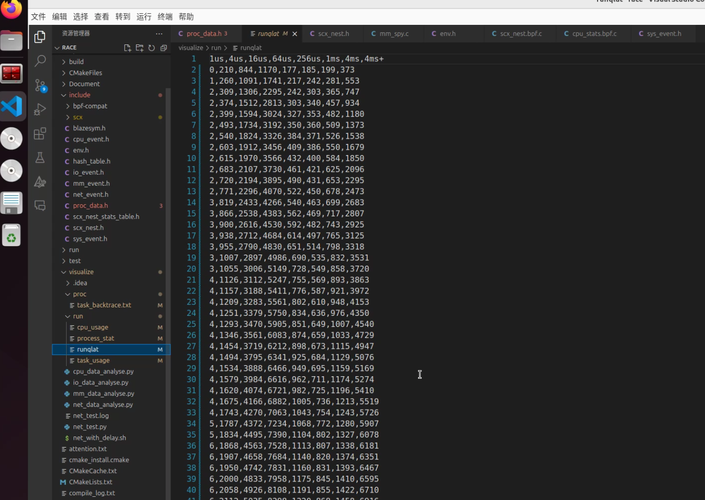
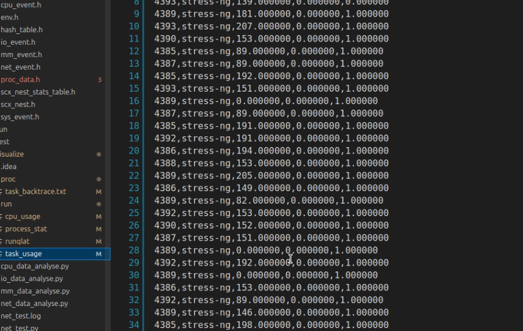
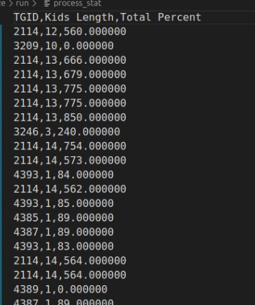
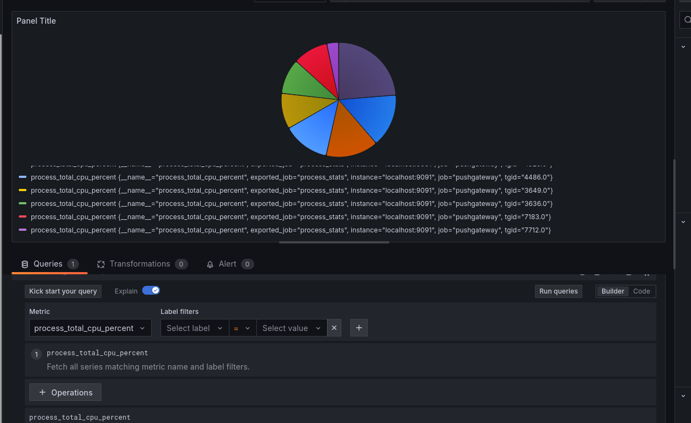
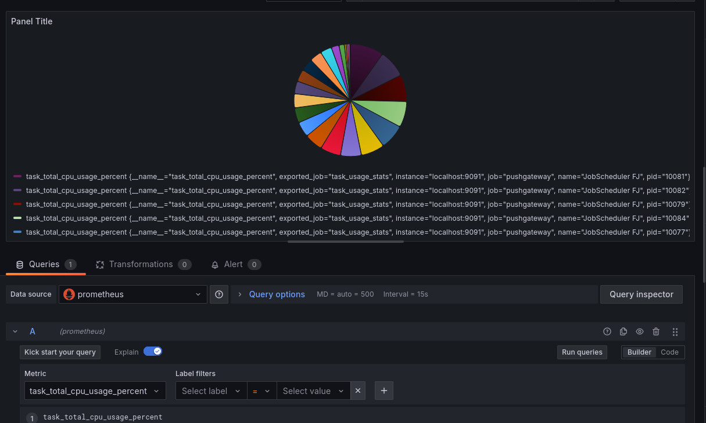

## 挂载的程序和相关钩子
这里把前面部分和cpu部分无关的输出删除了，只显示cpu的部分
```shell
root@ne0-System:~# bpftool prog show
1097: raw_tracepoint  name handle_sched_wakeup  tag 09665ce5a1061f80  gpl
	loaded_at 2024-12-22T14:14:47+0800  uid 0
	xlated 1208B  jited 730B  memlock 4096B  map_ids 527,536,544
	btf_id 438
1099: raw_tracepoint  name handle_sched_wakeup_new  tag 09665ce5a1061f80  gpl
	loaded_at 2024-12-22T14:14:47+0800  uid 0
	xlated 1208B  jited 730B  memlock 4096B  map_ids 527,536,544
	btf_id 438
1100: tracepoint  name handle_task_create  tag efc6aaf5cb501cf1  gpl
	loaded_at 2024-12-22T14:14:47+0800  uid 0
	xlated 464B  jited 276B  memlock 4096B  map_ids 527,544
	btf_id 438
1101: tracepoint  name handle_task_exit  tag bbd5266b129ac1f5  gpl
	loaded_at 2024-12-22T14:14:47+0800  uid 0
	xlated 536B  jited 316B  memlock 4096B  map_ids 527,536,531,533,537,544
	btf_id 438
1102: tracepoint  name record_task_switch  tag 84f5ae70e9eae07c  gpl
	loaded_at 2024-12-22T14:14:47+0800  uid 0
	xlated 6648B  jited 4141B  memlock 8192B  map_ids 528,529,527,531,539,544,533,542,530,536,537,540
	btf_id 438
1103: tracepoint  name record_backtrace  tag 609e86149c8868ed  gpl
	loaded_at 2024-12-22T14:14:47+0800  uid 0
	xlated 968B  jited 556B  memlock 4096B  map_ids 531,532,544,533,527
	btf_id 438
1104: tracepoint  name record_cpu_idle  tag da0312df36e18d94  gpl
	loaded_at 2024-12-22T14:14:47+0800  uid 0
	xlated 584B  jited 312B  memlock 4096B  map_ids 528,529,544
	btf_id 438
1105: tracepoint  name trace_sys_enter  tag b321ae7b2ce4198b  gpl
	loaded_at 2024-12-22T14:14:47+0800  uid 0
	xlated 1160B  jited 660B  memlock 4096B  map_ids 527,536,544
	btf_id 438
1106: tracepoint  name trace_sys_exit  tag ab90f585a0514ff8  gpl
	loaded_at 2024-12-22T14:14:47+0800  uid 0
	xlated 1152B  jited 653B  memlock 4096B  map_ids 527,536,544
	btf_id 438
1107: tracepoint  name trace_cpu_softirq_entry  tag 54c4d1a106cfa8a9  gpl recursion_misses 13
	loaded_at 2024-12-22T14:14:47+0800  uid 0
	xlated 712B  jited 403B  memlock 4096B  map_ids 528,529,544
	btf_id 438
1108: tracepoint  name trace_cpu_softirq_exit  tag 3d80b7c8e918ee61  gpl recursion_misses 13
	loaded_at 2024-12-22T14:14:47+0800  uid 0
	xlated 632B  jited 357B  memlock 4096B  map_ids 528,529,544
	btf_id 438
1109: tracepoint  name trace_cpu_irq_entry  tag eba63ed6afd29a18  gpl
	loaded_at 2024-12-22T14:14:47+0800  uid 0
	xlated 712B  jited 403B  memlock 4096B  map_ids 528,529,544
	btf_id 438
1110: tracepoint  name trace_cpu_irq_exit  tag 9626ba411786b4fa  gpl
	loaded_at 2024-12-22T14:14:47+0800  uid 0
	xlated 632B  jited 357B  memlock 4096B  map_ids 528,529,544
	btf_id 438
1111: perf_event  name handle_cpu_event  tag 47b18a86e41937b8  gpl
	loaded_at 2024-12-22T14:14:47+0800  uid 0
	xlated 2000B  jited 1318B  memlock 4096B  map_ids 545,534,544,529,528,538
	btf_id 438
1112: perf_event  name handle_sys_latency_event  tag 865cfeaa4297ac99  gpl
	loaded_at 2024-12-22T14:14:47+0800  uid 0
	xlated 1280B  jited 654B  memlock 4096B  map_ids 541,544,530
	btf_id 438
```
```shell
root@ne0-System:~# bpftool link show
1: tracing  prog 2  
	prog_type tracing  attach_type modify_return  
	target_obj_id 1  target_btf_id 35400  
408: raw_tracepoint  prog 1120  
	tp 'sched_wakeup'  
409: raw_tracepoint  prog 1122  
	tp 'sched_wakeup_new'  
410: perf_event  prog 1123  
	tracepoint sched_process_fork  
411: perf_event  prog 1124  
	tracepoint sched_process_exit  
412: perf_event  prog 1125  
	tracepoint sched_switch  
413: perf_event  prog 1126  
	tracepoint sched_switch  
414: perf_event  prog 1127  
	tracepoint cpu_idle  
415: perf_event  prog 1128  
	tracepoint sys_enter  
416: perf_event  prog 1129  
	tracepoint sys_exit  
417: perf_event  prog 1130  
	tracepoint softirq_entry  
418: perf_event  prog 1131  
	tracepoint softirq_exit  
419: perf_event  prog 1132  
	tracepoint irq_handler_entry  
420: perf_event  prog 1133  
	tracepoint irq_handler_exit  
421: perf_event  prog 1134  
	event 6 :0  
422: perf_event  prog 1135  
	event 6 :0  
```

挂载了14个ebpf程序，raw_tracepoint 2个，tracepoint 10 个，perf_event 2 个

## cpu使用情况
通过挂载在以下内核节点上的 BPF 程序，对 CPU 不同功能的使用率进行统计：
- 运行时间：sched_switch
- 空闲状态：cpu_idle
- 内核态或用户态：sys_enter 和 sys_exit
- 软中断：softirq_entry 和 softirq_exit
- 硬中断：irq_handler_entry 和 irq_handler_exit

这些节点的挂载覆盖 CPU 的各种工作状态，支持系统级别的使用率分析

本地文件保存在`visualize/run/cpu_usage.csv`中，格式如下
```
CPU ID,User Time,Kernel Time,Idle Time,IRQ Time,SoftIRQ Time
0,0.000000,0.050000,0.920000,0.000000,0.000000
1,0.000000,0.010000,0.940000,0.000000,0.000000
2,0.000000,0.020000,0.900000,0.000000,0.000000
3,0.000000,0.020000,0.960000,0.000000,0.000000
4,0.000000,0.050000,0.940000,0.000000,0.000000
5,0.000000,0.140000,0.840000,0.000000,0.000000
6,0.000000,0.050000,0.930000,0.000000,0.000000
7,0.000000,0.100000,0.840000,0.000000,0.000000
8,0.000000,0.010000,0.970000,0.000000,0.000000
9,0.000000,0.040000,0.860000,0.000000,0.000000
10,0.000000,0.020000,0.950000,0.000000,0.000000
11,0.030000,0.590000,0.290000,0.000000,0.000000
```
每500ms用perf事件输出一次

## cpu占用率高的线程的情况
系统为每个任务维护了一个 struct task_cpu_usage 数据结构，用于存储线程的 CPU 使用情况，并记录在 task_cpu_usage_map 中。
同时，通过以下机制对高占用线程进行捕获和输出：
1. 高占用线程的捕获
   - 使用函数 task_concerned_update(struct task_cpu_usage *task_usage, u32 threshold)
   - 该函数对线程的 CPU 占用情况进行判断，并将占用率高于阈值的线程移入 thread_occupied_map，并触发 perf 输出
2. 输出优化
   - 每 500 毫秒清理一次占用率记录
   - 设置参数确保提前超过阈值的线程不会被重复输出
   - 对于提前达到阈值的线程，其占用率根据时间比例进行线性增长，公式如下
   
   `u64 delta = (HALF_SECOND + task_usage->last_clear_time - now) * 10 / HALF_SECOND;`

输出保存在`visualize/run/task_usage.csv`
```
PID,Name,Total Percent,Kernel Percent,User Percent
76167,code,51.000000,1.000000,0.000000
76318,cpptools,185.000000,1.000000,0.000000
77306,xrdp,21.000000,1.000000,0.000000
3863,Xorg,10.000000,1.000000,0.000000
76167,code,42.000000,1.000000,0.000000
3863,Xorg,41.000000,1.000000,0.000000
77306,xrdp,53.000000,1.000000,0.000000
3863,Xorg,30.000000,1.000000,0.000000
77306,xrdp,37.000000,1.000000,0.000000
```

## cpu占用率高的进程的情况
统计高占用进程的逻辑与线程类似，但记录维度由 pid 转换为 tgid（进程 ID）。具体实现包括：
1. 进程 CPU 使用记录
   - 所有进程的 CPU 使用情况存储在 process_map 中
   - 通过 process_concerned_update(struct process_struct *ps, u32 threshold) 函数，判断高占用进程并触发记录与输出
2. 高占用进程的管理与输出
   - 高占用进程的信息存储在 process_occupied_map 中，并通过 perf 输出

这种设计与线程统计一致，便于从线程和进程两个维度捕获 CPU 高占用的异常行为

输出保存在`visualize/run/process_stat.csv`
```
TGID,Kids Length,Total Percent
77306,1,68.000000
3863,1,51.000000
76167,9,60.000000
76167,11,65.000000
77306,1,53.000000
77620,1,150.000000
```


## 调度延迟
调度延迟功能参考自 runqlat，用于监控任务等待 CPU 调度的时间分布。其具体实现特点如下：
1. 时间区间统计
   - 将任务等待调度的时间分为 8 个区间，分别代表不同的等待时间范围
   - 数据记录为累计值，从 BPF 程序启动开始，每 500 毫秒更新一次
2. 反映 CPU 压力
   - 累计值反映系统中任务的调度延迟分布，从中可以评估当前 CPU 的压力情况
   - 当存在异常任务占用大量 CPU 时，后几个区间的值会增长更快，表明调度压力显著增加

通过分析调度延迟，可以快速判断系统当前的调度健康状况，并为异常任务的定位提供依据

本地文件是在`visualize/run/runqlat`
```
1us,4us,16us,64us,256us,1ms,4ms,4ms+
4384,570,252,36,0,0,0,0
4764,1019,514,68,0,0,2,0
5144,1376,818,101,0,1,3,1
5336,1611,1067,125,1,1,3,1
5403,1680,1167,176,2,3,3,1
5415,1719,1221,234,2,3,3,1
5426,1746,1262,280,2,4,3,1
5432,1773,1296,319,2,4,3,1
5515,1842,1357,366,3,5,3,1
5728,1951,1413,391,3,5,3,1
6423,2338,1563,434,6,8,3,1
6498,2424,1626,483,6,8,3,1
6732,2567,1702,521,10,9,3,1
6975,2688,1783,568,10,9,3,1
6986,2737,1827,626,10,9,3,1
7192,2821,1874,659,11,9,3,1
```


## 实验
这部分对应的视频是”cpu部分”，同样这也是之后scx-nest部分的首个测试视频，下面所有的图片都是源于这个视频，具体数据分析在scx-nest部分详细分析






对比pid部分和tgid部分可以看到监视程序都成功把stress-ng识别了出来

对于csv数据也都做了可视化处理，对于cpu部分的就在`visualize/cpu_data_analyse.py`，这里展示部分统计图







