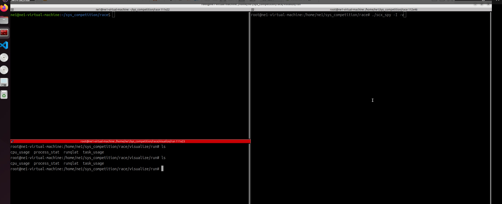
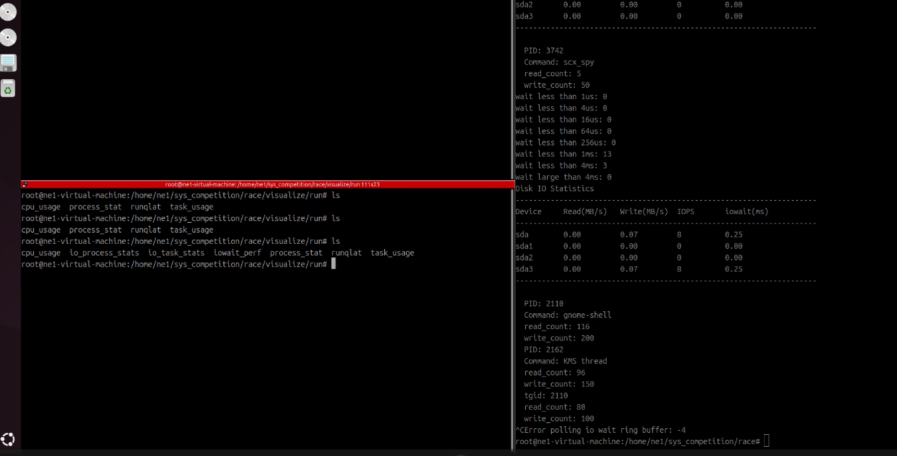
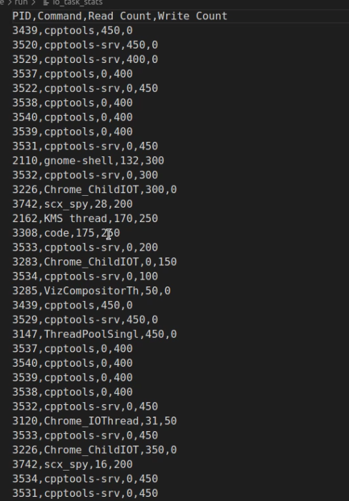
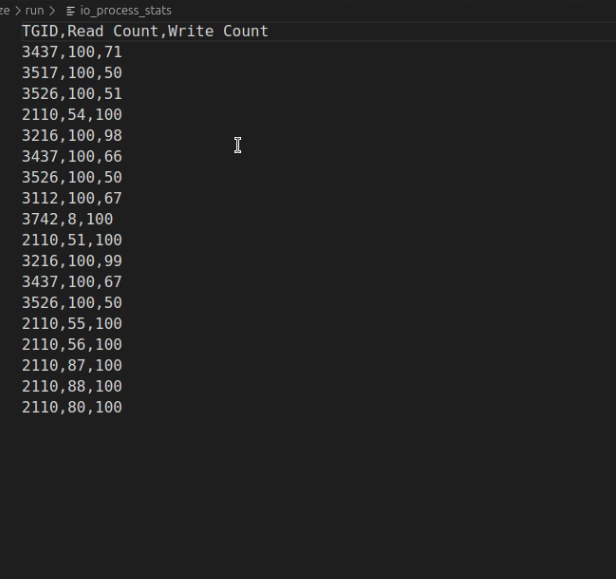
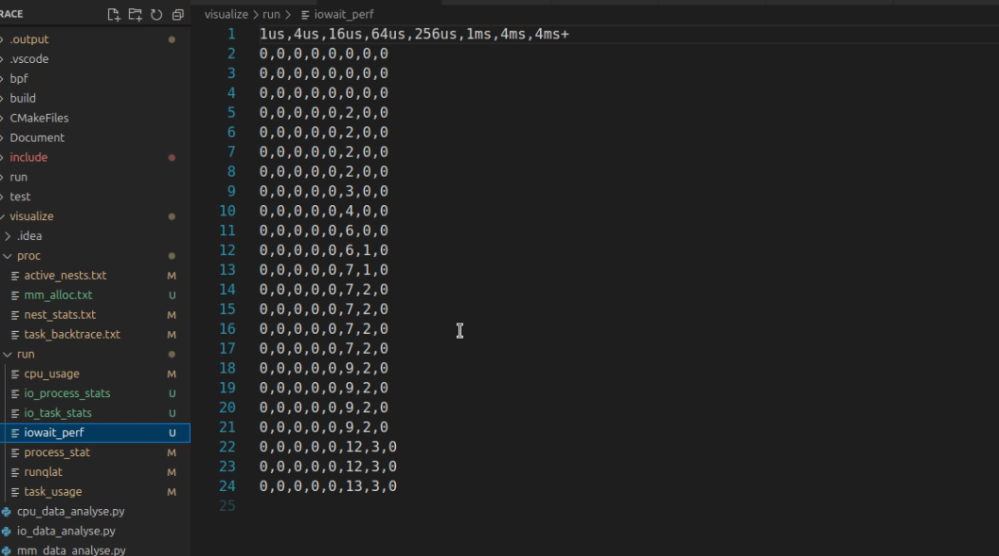

## 挂载的程序和相关钩子
```shell
root@ne0-System:~# bpftool link show
1: tracing  prog 2  
	prog_type tracing  attach_type modify_return  
	target_obj_id 1  target_btf_id 35400  
444: perf_event  prog 1178  
	tracepoint block_rq_issue  
445: perf_event  prog 1180  
	tracepoint block_rq_complete  
446: perf_event  prog 1182  
	tracepoint sys_enter_read  
447: perf_event  prog 1183  
	tracepoint sys_enter_write  
448: perf_event  prog 1184  
	tracepoint sched_process_exit  
449: perf_event  prog 1181  
	event 6 :0  
```
```shell
root@ne0-System:~# bpftool prog show
1178: tracepoint  name io_trace_rq_issue  tag cc594f0a6ac10c35  gpl
	loaded_at 2024-12-22T16:00:30+0800  uid 0
	xlated 112B  jited 69B  memlock 4096B  map_ids 602,611
	btf_id 478
1180: tracepoint  name io_trace_rq_complete  tag ede2777588a83655  gpl
	loaded_at 2024-12-22T16:00:30+0800  uid 0
	xlated 584B  jited 340B  memlock 4096B  map_ids 602,604,611
	btf_id 478
1181: perf_event  name handle_io_wait_event  tag efb43df12d62b386  gpl
	loaded_at 2024-12-22T16:00:30+0800  uid 0
	xlated 1280B  jited 654B  memlock 4096B  map_ids 603,611,604
	btf_id 478
1182: tracepoint  name io_trace_enter_read  tag 723f556fb255b6fe  gpl
	loaded_at 2024-12-22T16:00:30+0800  uid 0
	xlated 2256B  jited 1200B  memlock 4096B  map_ids 605,606,607,611,608,609
	btf_id 478
1183: tracepoint  name io_trace_enter_write  tag e393cb3e6a12faa6  gpl
	loaded_at 2024-12-22T16:00:30+0800  uid 0
	xlated 2264B  jited 1203B  memlock 4096B  map_ids 605,606,607,611,608,609
	btf_id 478
1184: tracepoint  name handle_io_task_exit  tag c08bfb018faad224  gpl
	loaded_at 2024-12-22T16:00:30+0800  uid 0
	xlated 184B  jited 117B  memlock 4096B  map_ids 605,611
	btf_id 478
```
总挂载点数量6个，tracepoint5 个（block_rq_issue, block_rq_complete, sys_enter_read, sys_enter_write, sched_process_exit），
perf_event 1 个


## 系统IO的整体情况
cpu部分是当时第一个编写的，所以把部分可以从proc的读的也重新用ebpf复现了一下，
之后的三个部分都是先通过proc获取整体性的数据，然后对于proc获得不了的，再进一步ebpf

```shell
Disk IO Statistics
---------------------------------------------------------------------
Device     Read(MB/s)   Write(MB/s)  IOPS       iowait(ms)  
---------------------------------------------------------------------
nvme0n1    0.00         0.09         12         0.42        
nvme0n1p1  0.00         0.00         0          0.00        
nvme0n1p2  0.00         0.00         0          0.00        
nvme0n1p3  0.00         0.00         0          0.00        
nvme0n1p4  0.00         0.00         0          0.00        
nvme0n1p5  0.00         0.00         0          0.00        
nvme0n1p6  0.00         0.00         0          0.00        
nvme0n1p7  0.00         0.00         0          0.00        
nvme0n1p8  0.00         0.00         0          0.00        
nvme0n1p9  0.00         0.09         12         0.42        
nvme0n1p10 0.00         0.00         0          0.00        
sda        0.00         0.00         0          0.00        
sda1       0.00         0.00         0          0.00        
---------------------------------------------------------------------
```
从proc中读取数据处理后得到的表格，是一张显示磁盘和分区 I/O 统计的表格，用于监控系统中各磁盘设备及其分区的读写性能指标
- Device：磁盘或分区的设备名称，例如 nvme0n1, nvme0n1p1, sda
- Read/Write(MB/s)：每秒读取/写入的数据量（单位：MB/s）
- IOPS：每秒 I/O 操作数（Input/Output Operations Per Second）
- iowait：I/O 等待时间（单位：毫秒），表示设备平均等待时间

检测各个磁盘和分区的 I/O 活动，识别活跃的设备和潜在的性能瓶颈。


## 对写入或读取超阈值的task进行监视
1. 对写入或读取超阈值的任务进行监视
   - 实现方式
     - 建立 io_task_stats_map，用于映射每个任务的读取量和写入量
     - 挂载在以下 tracepoint 节点
       - tracepoint/syscalls/sys_enter_write：统计写入调用次数
       - tracepoint/syscalls/sys_enter_read：统计读取调用次数
   - 实现逻辑
     - 通过 io_task_compare_and_commit(struct io_task_stats *task) 函数，对超过阈值的任务进行捕获并触发 perf 输出
2. 阈值定义
   - 统计目标：在指定时间窗口内的读取和写入调用次数，即读写频率
   - 具体结构为
```c
struct io_stats_threhold task = {
    .read_count = 50,
    .write_count = 50,
    .time_window = (1000 * MSEC) // 1s
};
```
    - 提前达到阈值的调整：对于提前达到阈值的任务，根据距离时间窗口末尾的时间，动态调整统计值
```c
u64 time_spare = task->last_clear_time + threhold->time_window - now;
time_spare = time_spare * 100 / threhold->time_window;
time_spare = (u32)time_spare;
if (time_spare > 10) {
    buff->write_count *= (time_spare / 10);
    buff->read_count *= (time_spare / 10);
}
```


对于结果的输出，本地的数据保存在`visualize/run/io_task_stats.csv`
```
PID,Command,Read Count,Write Count
76310,cpptools,450,0
76493,cpptools-srv,450,0
76495,cpptools-srv,0,450
76500,cpptools,0,450
76502,cpptools,0,450
76499,cpptools,0,450
76501,cpptools,0,450
76497,cpptools-srv,0,450
76494,cpptools-srv,0,450
76241,code,198,300
77982,os_spy,40,200
77982,os_spy,48,200
77982,os_spy,48,200
77982,os_spy,48,200
2899,prometheus-node,450,0
2896,prometheus-node,450,0
7023,prometheus-node,450,0
```

## 对写入或读取超阈值的process进行监视
- 实现方式
  - 类似于任务的监视机制，但统计的单位为进程
  - 使用 io_process_stats_map 记录每个进程的 IO 行为
- 特点
  - 通过相同的逻辑判断超阈值的进程，并触发 perf 输出
  - 便于从全局视角监控占用 IO 资源较多的进程

数据存储在本地的`visualize/run/io_process_stats`
```
TGID,Read Count,Write Count
76306,100,65
76490,100,51
76076,100,56
723,100,2
723,101,2
3993,41,100
3993,60,100
723,100,1
723,101,1
3993,44,100
```

## 对IO请求的相应延迟
- 延迟计算
  - 挂载在以下 tracepoint 节点
    - tracepoint/block/block_rq_issue：记录 IO 请求开始的时间
    - tracepoint/block/block_rq_complete：记录 IO 请求完成的时间
  - 计算请求延迟为两次时间记录的差值
- 延迟统计
  - 对请求延迟进行计数统计，记录延迟分布数据

具体的本地数据存储在`visualize/run/iowait_perf`

```
1us,4us,16us,64us,256us,1ms,4ms,4ms+
0,0,0,0,1,0,0,0
0,0,0,0,2,1,1,0
0,0,0,0,2,1,1,0
0,0,0,0,3,1,3,0
0,0,0,0,3,1,3,0
0,0,0,0,4,1,3,0
0,0,0,0,4,1,3,0
0,0,0,1,8,3,6,1
0,0,0,1,8,3,6,1
0,0,0,1,8,4,6,2
0,0,0,1,8,4,6,2
0,0,0,1,8,4,6,2
0,0,0,1,8,4,6,2
0,0,0,1,8,5,6,2
0,0,0,1,8,5,6,2
0,0,0,1,8,7,7,2
0,0,0,1,8,7,7,2
```


## 实验
具体在视频链接的“IO部分”











