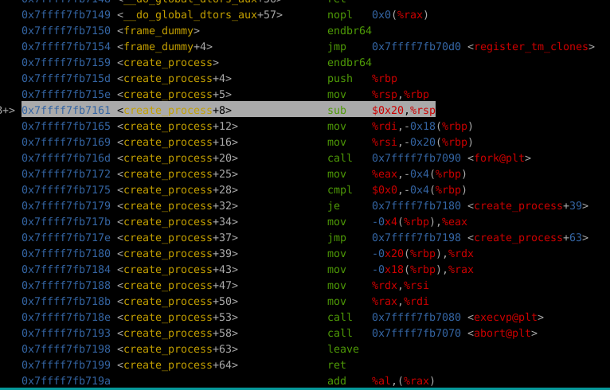
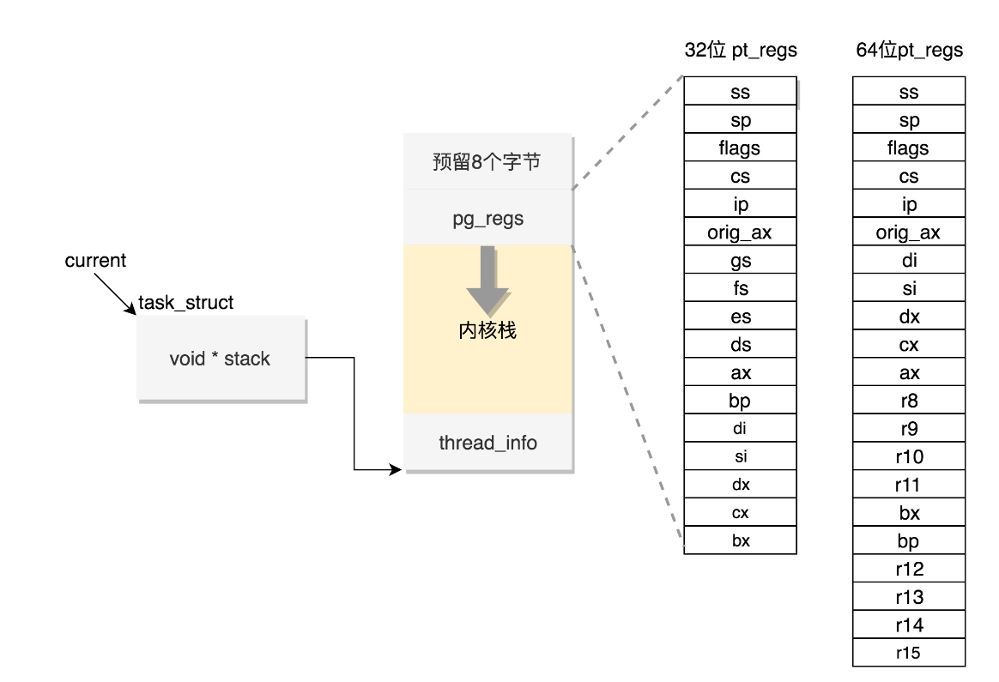
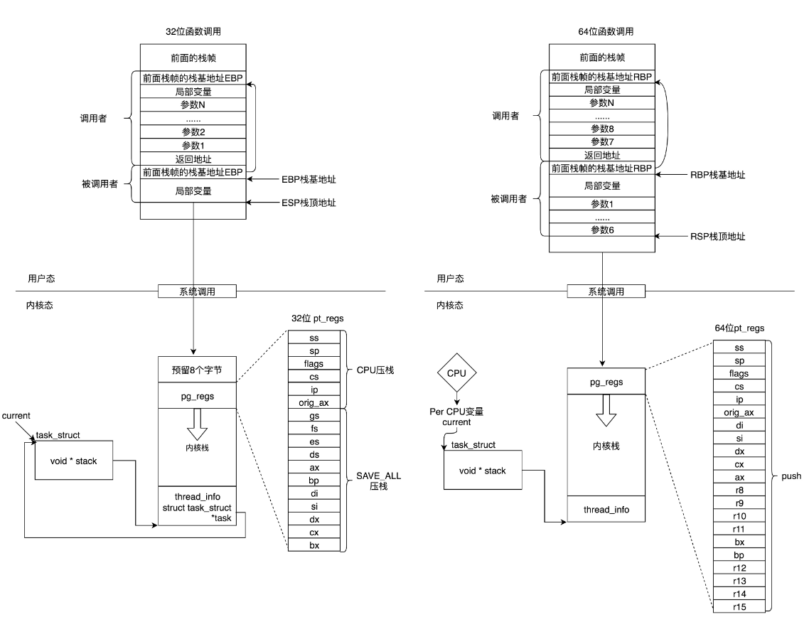

### task_struct结构整体性介绍
内核源码中task_struct结构光sched.h中就有七八百行，里面的结构开枝散叶可以说是个相当庞大的结构

这里是按功能将部分重要成员介绍
```c
task_struct
├── Process Identification
│   ├── pid: process id,进程的唯一标识符 (PID)
│   ├── tgid: thread group ID,线程组 ID
│   └── comm: 进程的可读名称
├── Process State Management
│   ├── state: 当前进程的状态 (TASK_RUNNING, TASK_INTERRUPTIBLE 等)
│   ├── exit_state: 进程退出状态
│   ├── exit_code: 进程退出时的返回码
│   ├── jobctl: 记录任务控制的状态（如作业控制信号）
│   └── atomic_flags: 进程的原子操作标志，用于同步
├── Scheduling
│   ├── prio: 进程的动态优先级
│   ├── static_prio: 进程的静态优先级
│   ├── rt_priority: 实时任务的优先级
│   ├── sched_class: 进程的调度类（CFS, RT 等）
│   ├── se: 普通调度实体 (sched_entity)
│   ├── rt: 实时调度实体 (sched_rt_entity)
│   ├── sched_info: 调度器的统计信息
│   └── on_rq: 进程是否在运行队列上的标志
├── Memory Management
│   ├── mm: 指向进程的内存描述符 (mm_struct)
│   ├── active_mm: 内核线程的内存描述符，当 mm == NULL 时使用
│   ├── min_flt: 次缺页错误次数
│   ├── maj_flt: 主缺页错误次数
│   ├── reclaim_state: 内存回收状态，用于进程内存管理
│   └── numa_group: NUMA 相关信息，用于处理多处理器系统上的内存分配
├── File System and I/O Management
│   ├── fs: 文件系统相关信息，指向进程的 fs_struct
│   ├── files: 打开文件的表 (files_struct)
│   ├── io_context: I/O 上下文，用于跟踪进程的 I/O 操作
│   ├── splice_pipe: 缓存最近的管道 (pipe_inode_info)
│   ├── bio_list: 块设备 I/O 相关信息
│   └── plug: 用于块设备 I/O 的插入操作状态
├── Signal Handling
│   ├── signal: 信号处理结构 (signal_struct)，进程的信号控制块
│   ├── sighand: 信号处理程序表 (sighand_struct),正在通过信号处理函数进行处理的信号
│   ├── pending: 挂起的信号队列
│   ├── blocked: 阻塞的信号集
│   └── pdeath_signal: 父进程终止时要发送的信号
├── Security and Credentials
│   ├── cred: 进程的有效凭证 (cred)，包括 UID、GID 等
│   ├── real_cred: 进程的实际凭证
│   ├── seccomp: Seccomp 安全配置，限制系统调用的安全机制
│   ├── audit_context: 审计相关的上下文信息
│   └── security: 用于 LSM 模块的安全字段
├── Inter-Process Relationships
│   ├── real_parent: 实际的父进程
│   ├── parent: 接收 SIGCHLD 的父进程
│   ├── children: 子进程链表
│   ├── sibling: 兄弟进程链表
│   ├── group_leader: 线程组的组长指针
│   └── ptraced: 被 ptrace() 跟踪的进程链表
├── Namespace Management
│   ├── nsproxy: 命名空间代理结构，存储进程的命名空间信息
│   ├── cgroups: 进程所属的控制组 (cgroup)
│   ├── cg_list: cgroup 任务链表
│   └── namespaces: 进程的各种命名空间 (pid, net, uts, ipc 等)
├── Time and Statistics
│   ├── start_time: 进程的启动时间（单调时间）
│   ├── utime: 用户态运行时间
│   ├── stime: 内核态运行时间
│   ├── nvcsw: 进程的自愿上下文切换次数
│   ├── nivcsw: 进程的非自愿上下文切换次数
│   └── sched_statistics: 调度器的统计信息
├── Thread and CPU State
│   ├── thread: 每个 CPU 特定的线程状态结构 (thread_struct)
│   ├── recent_used_cpu: 最近使用的 CPU
│   ├── on_cpu: 进程是否当前正在运行的标志
│   └── wake_cpu: 唤醒进程时使用的目标 CPU
├── Debugging and Tracing
│   ├── ptrace: 记录 ptrace 系统调用的调试状态
│   ├── last_siginfo: 上次发送给该进程的信号信息
│   ├── task_state_change: 记录进程状态变更的时间戳
│   └── trace_recursion: 跟踪递归的掩码和计数器
├── Resource Limits and Accounting
│   ├── rlimit: 资源限制 (RLIMIT_CPU, RLIMIT_NOFILE 等)
│   ├── ioac: I/O 统计信息，用于 I/O 资源消耗的统计
│   └── acct_rss_mem1: 进程的 RSS 内存使用量
├── Error Handling and Recovery
│   ├── task_works: 用于延迟处理的任务列表（如信号处理）
│   ├── restart_block: 系统调用重启时使用的上下文
│   └── oom_reaper_list: 用于记录 OOM 情况下需要处理的进程
```

### 进程状态
- TASK_RUNNING：此状态的进程在可运行队列中，等待 CPU 调度程序分配时间片
- TASK_INTERRUPTIBLE，可中断的睡眠状态：虽然在睡眠，等待 I/O 完成，但是这个时候一个信号来的时候，进程还是要被唤醒。只不过唤醒后，
不是继续刚才的操作，而是进行信号处理
- TASK_UNINTERRUPTIBLE，不可中断的睡眠状态：不可被信号唤醒，只能死等 I/O 操作完成。一旦 I/O 操作因为特殊原因不能完成，这个时候，谁也叫不醒这个进程了。
kill 本身也是一个信号，既然这个状态不可被信号唤醒，kill 信号也被忽略了。除非重启电脑，没有其他办法。
- TASK_KILLABLE，可以终止的新睡眠状态：进程处于这种状态中，它的运行原理类似 TASK_UNINTERRUPTIBLE，只不过可以响应致命信号
```c
#define TASK_KILLABLE           (TASK_WAKEKILL | TASK_UNINTERRUPTIBLE)
```
- TASK_STOPPED：进程被停止（暂停），通常是收到 SIGSTOP、SIGTSTP、SIGTTIN 或 SIGTTOU 信号导致，等待外部信号（如 SIGCONT）来恢复运行，常用于调试时暂停进程执行
- TASK_TRACED： 进程正在被调试器（如 gdb）跟踪，通常是由于执行了 ptrace 系统调用
- EXIT_ZOMBIE (僵尸态)：进程已经终止，但它的父进程尚未通过 wait() 系统调用获取它的退出状态
- EXIT_DEAD (死亡态)：僵尸进程的终止状态已经被其父进程获取，进程的资源已被完全回收，在该状态下，进程已经不再存在，其进程表项会被内核回收。
- TASK_PARKED：某些情况下线程会被“挂起”，等待被唤醒或处理。通常用于某些特殊的硬件或资源场景
```c
sys_fork
    ├── _do_fork
    ├── wake_up_new_task
    ├── p->state = TASK_RUNNING
           ├── 进程分配到 CPU，进入运行状态
           │   ├── 时间片用完或被抢占，重新调度
           │   └── 执行任务
           ├── 进程等待某事件或资源：
           │   ├── TASK_INTERRUPTIBLE (可被信号唤醒的睡眠)
           │   ├── TASK_UNINTERRUPTIBLE (不可被信号唤醒的睡眠)
           │   └── TASK_KILLABLE (只能被 SIGKILL 终止的睡眠)
           ├── 进程被 SIGSTOP 信号停止：
           │   └── TASK_STOPPED (进程暂停)
           └── 进程退出，进入僵尸状态：
               └── EXIT_ZOMBIE (进程结束但父进程未回收)
```

### 进程权限
#### 基本知识
- 用户ID（UID）：用户 ID 是系统中每个用户的唯一标识符，用来区分不同的系统用户
  - 系统用户: 是操作系统中创建的每个用户账户（如 root、user1、user2 等），每个系统用户都有一个唯一的 UID。通过 UID，系统可以管理不同用户的权限和资源访问
  - UID 0: 在 Linux 系统中，UID 为 0 的用户是超级用户（root），拥有最高权限，可以执行所有操作
  - 当程序或进程运行时，它继承了启动它的用户的 UID，这个 UID 用于控制进程的权限范围。比如，一个普通用户运行的程序不能访问只有 root 用户能访问的资源
  - 进程可以使用 setuid() 系统调用临时改变其 UID，获取不同的权限。这在某些情况下（如 SUID 程序）用于临时提升进程的权限
- 组 ID (GID)：组 ID 是系统中每个用户组的唯一标识符，用于管理一组用户的访问权限
  - 用户组: 系统中的每个用户通常都属于至少一个用户组，用户组是多个用户的集合，组中的用户共享相同的组权限。每个用户组都有一个唯一的 GID
  - 一个用户可以同时属于多个组：每个用户都有一个主组（Primary Group）和可能的多个附加组（Supplementary Groups）。
    主组的 GID 记录在用户的账户信息中，而附加组的 GID 则保存在 group_info 结构中
  - 补充组 (Supplementary Groups)：每个用户可以属于多个组，除了主组外，用户还可以属于多个附加组
    - 进程不仅继承用户的主组 GID，还会继承用户的附加组。这样进程可以通过多个组的权限来访问系统资源


struct cred 是 Linux 内核中用于描述进程身份（credentials）的数据结构，
它保存了与用户、组及其权限相关的信息。这个结构体在权限管理和访问控制中扮演了重要角色，控制进程在系统中能做什么。

```c
struct cred {
	atomic_long_t	usage;
	kuid_t		uid;		/* real UID of the task */
	kgid_t		gid;		/* real GID of the task */
	kuid_t		suid;		/* saved UID of the task */
	kgid_t		sgid;		/* saved GID of the task */
	kuid_t		euid;		/* effective UID of the task */
	kgid_t		egid;		/* effective GID of the task */
	kuid_t		fsuid;		/* UID for VFS ops */
	kgid_t		fsgid;		/* GID for VFS ops */
	unsigned	securebits;	/* SUID-less security management */
	kernel_cap_t	cap_inheritable; /* caps our children can inherit */
	kernel_cap_t	cap_permitted;	/* caps we're permitted */
	kernel_cap_t	cap_effective;	/* caps we can actually use */
	kernel_cap_t	cap_bset;	/* capability bounding set */
	kernel_cap_t	cap_ambient;	/* Ambient capability set */
#ifdef CONFIG_KEYS
	unsigned char	jit_keyring;	/* default keyring to attach requested
					 * keys to */
	struct key	*session_keyring; /* keyring inherited over fork */
	struct key	*process_keyring; /* keyring private to this process */
	struct key	*thread_keyring; /* keyring private to this thread */
	struct key	*request_key_auth; /* assumed request_key authority */
#endif
#ifdef CONFIG_SECURITY
	void		*security;	/* LSM security */
#endif
	struct user_struct *user;	/* real user ID subscription */
	struct user_namespace *user_ns; /* user_ns the caps and keyrings are relative to. */
	struct ucounts *ucounts;
	struct group_info *group_info;	/* supplementary groups for euid/fsgid */
	/* RCU deletion */
	union {
		int non_rcu;			/* Can we skip RCU deletion? */
		struct rcu_head	rcu;		/* RCU deletion hook */
	};
} __randomize_layout;
```
这里细化讲一部分，剩下的在注释中就能理解大概
- struct user_struct user：指向 user_struct 结构体，表示当前用户的引用和配额管理
  - user_struct 用于管理系统中与用户相关的资源和配额。它跟踪用户的进程数、文件句柄数、内存使用等信息
- struct user_namespace user_ns：指向用户命名空间 (user_namespace) 的指针
  - 用户命名空间 是 Linux 容器的关键特性之一，它允许在同一系统上创建不同的用户命名空间，使得不同命名空间中的用户和组 ID 是独立的
  - user_ns 允许进程在特定的命名空间中使用不同的 UID 和 GID，而不影响其他命名空间中的用户和组
  - 容器实现的底层原理之一，到时候会详细说
- struct group_info group_info：group_info 存储进程的补充组信息

#### 几个uid和gid
- atomic_long_t usage：引用计数器，表示当前 cred 结构体的引用次数
  - 内核使用 usage 来管理 cred 的生命周期，当一个进程不再使用这个 cred 时，引用计数器会减少。如果计数降为零，内核会释放该 cred 结构体
- kuid_t uid, gid：uid 是任务的 真实用户 ID (Real UID)，gid 是 真实组 ID (Real GID)
  - 一般情况下，谁启动的进程，就是谁的 ID。但是权限审核的时候，往往不比较这两个，也就是说不大起作用
- kuid_t euid, egid：任务的 有效用户 ID (Effective UID)，egid 是 有效组 ID (Effective GID)
  - 表示当前进程的“活动身份”，**它决定了进程在系统中的权限**
  - 一个进程可以通过 SUID 程序或 seteuid() 系统调用临时改变其 euid，从而获取额外的权限
  - SUID 的工作原理：
    - 如果一个可执行文件的 SUID 位被设置，那么当任何用户运行该程序时，程序会临时获得该文件的所有者的权限，即 euid 会被设置为文件的所有者 UID
    - 这样，程序的 euid 就是文件的所有者 UID（例如，root），而 uid 仍然是启动该程序的用户 UID
- kuid_t suid, sgid：suid 是任务的 保存的用户 ID (Saved UID)、保存的组 ID (Saved GID)
  - 用于权限的回退和恢复。它们是在执行 setuid()、setgid() 等系统调用后保存的原始 ID
  - 当进程以某种临时方式（比如通过 SUID 程序）改变了 euid 和 egid 时，保存的 UID 和 GID 可以用于将进程恢复到原始身份
- kuid_t fsuid, fsgid：文件系统操作使用的用户 ID、组 ID
  - 控制文件系统操作时的权限，在访问文件或目录时，系统会参考 fsuid 和 fsgid，而不是 euid 和 egid

一般说来，fsuid、euid，和 uid 是一样的，fsgid、egid，和 gid 也是一样的。因为谁启动的进程，就应该审核启动的用户到底有没有这个权限。

这里举几个用到SUID的例子
- passwd 程序：它允许普通用户修改自己的密码，虽然密码文件 /etc/shadow 只有 root 用户可以修改
  - 当用户运行 passwd 时，进程会以用户的 UID 启动，但由于 passwd 的 SUID 位被设置，它的 euid 被临时更改为 root（UID 0）
  - 这样，程序获得了修改 /etc/shadow 文件的权限，因为它现在以 root 的权限运行
- sudo命令：sudo 程序需要在执行时临时获得 root 权限，以便能够执行系统级的管理任务。为了实现这一点，sudo 使用了 SUID（Set User ID） 机制
  - 可以通过 ls -l 命令查看 sudo 程序的权限，来确认 SUID 位是否设置
  - rwsr-xr-x 中的 s 就表示 SUID 位已经设置，文件的所有者是 root，因此当任何用户执行 sudo 时，它会以 root 权限运行
  - 用户输入 sudo 命令，例如 sudo apt update
    - 系统调用时，由于 sudo 的 SUID 位被设置，进程的 有效用户 ID (euid) 被临时设置为 root，即使实际运行该命令的用户是一个普通用户
    - 如果用户被授权运行该命令，sudo 会以 root 权限执行用户输入的命令（例如 apt update），否则会拒绝执行
    - 完成命令执行后，进程的权限将恢复到普通用户的权限
```c
(base) ne0@ne0-System:~$ ls -l /usr/bin/sudo
-rwsr-xr-x 1 root root 232416  4月  4  2023 /usr/bin/sudo
```

#### capabilities
除了以用户和用户组控制权限，Linux 还有另一个机制就是capabilities，设计目的是将超级用户（root 用户）的权力进行细化控制，
允许非 root 用户执行某些特权操作，而不必赋予它们所有 root 权限。这部分设计让系统可以更灵活地分配权限，并提高安全性。
每个能力代表一个具体的权限，例如，CAP_NET_ADMIN 允许管理网络接口，CAP_SYS_ADMIN 允许执行各种系统管理操作。

- cap_inheritable（可继承能力）：表示当前进程的子进程可以继承的能力集合
- cap_permitted（允许的能力）：任务层面，cap_permitted 是被允许的所有能力集合。这个字段定义了进程在**当前环境下可能获得的能力的最大集合**
- cap_effective（实际使用的能力）：cap_effective 是进程当前 实际生效的能力集合
- cap_ambient（环境能力集合）：一种环境能力集合，它允许将某些能力从父进程继承到子进程，并始终处于 cap_effective 状态
  - 非 root 用户进程使用 exec 执行一个程序的时候，如何保留权限的问题，当执行 exec 的时候，cap_ambient 会被添加到 cap_permitted 中，同时设置到 cap_effective 中
-  cap_bset（能力边界集合）：也就是 capability bounding set，**系统层面**，系统层面的安全限制，它定义了一个进程能够获得的所有能力的上限。
  - 如果这个集合中不存在某个权限，那么系统中的所有进程都没有这个权限。即使root权限执行的进程也一样


### 用户栈和内核栈
#### 用户栈
用户栈是每个进程或线程在用户态（user space）运行时使用的栈，主要用于存储局部变量、函数参数、返回地址等。

每个线程都有独立的用户栈，用于保存该线程的函数调用信息、局部变量、返回地址等。这是因为每个线程执行自己的控制流，调用不同的函数，
需要独立的栈来保存执行状态。尽管线程共享同一个进程的地址空间（如代码段、全局变量、堆等），但每个线程的用户栈是独立的。

用户栈的具体位置通常与task的内存管理结构（mm_struct）有关，包含了进程的虚拟内存区域以及用户栈指针等信息。
这个结构到内存关系部分在详细说


- 用户栈的布局
```shell
+----------------------------+  <- 栈顶（高地址）
| 返回地址                    |
+----------------------------+
| 函数参数                    |
+----------------------------+
| 局部变量                    |
+----------------------------+
| 下一个栈帧（嵌套函数调用）  |
+----------------------------+
| ...                         |
+----------------------------+  <- 栈底（低地址）
```
可以说线程的用户栈是由线程中所有函数的栈帧组成的
- 栈帧是每个函数调用时在栈上分配的内存块。每次函数调用，都会在栈上分配一个栈帧，存储该函数的局部变量、参数和返回地址等信息。
当函数嵌套调用时，每个嵌套函数都会在栈上创建一个新的栈帧，新的栈帧位于栈顶。
- 用户栈是栈帧的集合。栈帧按调用顺序在栈上连续分配，栈的增长方向通常是从高地址向低地址。当前栈顶指针 rsp 指向最上层的栈帧，也就是当前正在执行的函数的栈帧。
每次函数调用都会在用户栈上创建新的栈帧，函数返回时则会从用户栈中弹出相应的栈帧。


- 栈帧的结构
```shell
+-----------------------------+  <- 栈顶，高地址（内存地址较大）
| 返回地址 (Return Address)   |  <- 调用函数时，返回地址被压入栈
+-----------------------------+
| 调用者的 %rbp (Old %rbp)    |  <- 保存调用者的基址指针 (Base Pointer)
+-----------------------------+
| 局部变量 1 (Local Variable 1)|
+-----------------------------+
| 局部变量 2 (Local Variable 2)|
+-----------------------------+
| 参数 1 (Argument 1)         |  <- 通常保存在偏移量处
+-----------------------------+
| 参数 2 (Argument 2)         |
+-----------------------------+
| ...                         |  <- 更多局部变量或临时存储的空间
+-----------------------------+
| %rsp (当前栈指针)            |  <- 栈底，低地址
+-----------------------------+
```
- 返回地址: 在调用一个函数时，call 指令会将返回地址（调用者的下一条指令地址）压入栈中，这样当被调用的函数执行完毕时，ret 指令会从栈中弹出返回地址并跳转回调用者
- 旧的 rbp（调用者的栈帧基址）: 在进入新函数时，rbp 会保存调用者的栈帧指针（基址指针），以便函数返回时能够恢复调用者的栈帧。
通过 push %rbp 保存调用者的 rbp，而后通过 mov %rsp, %rbp 设置新的栈帧基址
- 局部变量和临时数据: 这些变量是在函数内部定义的局部变量，它们通常存储在栈上并且位于 rbp 的偏移位置。
局部变量可以根据需要占用不同的栈空间。通过 sub 指令减少 rsp 的值分配栈空间
- 传递的参数: 在 x86-64 的调用约定中，函数的前 6 个参数通常通过寄存器传递，但它们通常会在进入函数后保存到栈中，
以便函数使用。参数保存在栈的 rbp 基址的某些偏移量处
- 栈底 (%rsp): 栈指针 rsp 指向当前栈顶，栈帧结束时恢复 rsp，并通过 leave 指令将 rbp 恢复成之前的值，最终通过 ret 从栈中弹出返回地址

下面这个create_process的栈帧就是上面的一个例子的直接表现



#### 内核栈
在 Linux 内核中，每个task都有一个内核栈（kernel stack），用于在task处于内核态时保存执行的上下文和临时数据。内核栈在系统调用、异常处理、以及中断处理时尤为重要。

内核栈是进程切换到内核态时使用的栈，用于存储以下内容：
- 系统调用的上下文信息：当一个用户态进程通过系统调用进入内核态时，内核栈用于保存系统调用的参数、返回地址等信息
- 中断或异常处理的上下文：当中断或异常发生时，CPU 会自动切换到内核态，此时内核栈用于保存 CPU 的寄存器状态等信息，以便中断处理结束后可以恢复正常的执行状态
- 内核函数调用的局部变量：当内核调用自身的函数时，和用户态一样，内核函数的局部变量也会被保存在内核栈上

简单来说，内核栈是内核态下执行代码的临时存储区域，它保存了task的内核态执行环境。

对于内核栈和用户栈的区别，作用方面的区别上面有了，总的来说，是由于程序在 用户态和内核态 之间的**权限范围**和行为差异导致的
- 栈的大小与位置
  - 用户栈：大小一般不是固定的，可以根据需要动态增长
  - 内核栈：内核栈的大小通常是固定的。典型的 Linux 系统中，内核栈大小为两页内存，由于内核栈的大小固定且较小，内核中不能进行过度复杂的递归操作，避免栈溢出。
- 栈帧管理
  - 用户栈：栈帧管理由用户态程序和编译器的约定来控制。每个函数调用都会在用户栈上分配一个新的栈帧
  - 内核栈：栈帧管理由内核来控制。当内核调用内核态的函数时，也会在内核栈上分配栈帧

#### task_struct中对于内核栈的管理
在 task_struct 中，内核栈的管理是通过两个重要的字段来进行的，分别是：
- thread_info 结构: 存放了线程的标志、状态、CPU 信息等。thread_info 通常位于内核栈的低地址部分，也就是内核栈的基址。
- stack 指针: task_struct 中的 void *stack 指针指向当前进程的内核栈。每个进程的内核栈有固定大小（通常为 8KB 或 16KB），这个指针指向内核栈的起始地址。


内核栈的结构可以由上图表示（预留8个字节是对于32位系统），内核栈的底部通常是 thread_info 结构，栈的顶部存储着处理系统调用或中断时需要保存的寄存器内容，这些寄存器通过 pt_regs 结构保存。
当发生系统调用时，系统从用户态切换到内核态，此时首先要做的是保存当前运行线程的上下文（包括 CPU 寄存器），系统会将寄存器的值压入内核栈，并存储在 pt_regs 结构中。

在内核代码中，thread_info 和 stack 被封装在一个叫做 thread_union 的联合体中：
thread_union 结合了线程的 内核栈 和 thread_info，这样可以高效地组织内核栈，并通过栈指针快速访问 thread_info 结构
```c
union thread_union {
    #ifndef CONFIG_THREAD_INFO_IN_TASK
    struct thread_info thread_info;
    #endif
    unsigned long stack[THREAD_SIZE / sizeof(long)];
};
```
- 对于从task找到对应的内核栈，直接利用stack指针即可
- 对于从内核栈找到对应的task
  - 首先从栈顶位置减去THREAD_SIZE，定位到thread_info的位置
  - 之后thread_info中有指向task的指针
```c
struct thread_info {
	struct task_struct	*task;		/* main task structure */
	unsigned long		flags;		/* low level flags */
	__u32			cpu;		/* current CPU */
	int			preempt_count;  /* 0 => preemptable,
						   <0 => BUG */
	struct thread_info	*real_thread;    /* Points to non-IRQ stack */
	unsigned long aux_fp_regs[FP_SIZE];	/* auxiliary fp_regs to save/restore
						   them out-of-band */
};
```
在上面代码中可以发现有个real_thread的参数，这个参数设计是为了处理中断处理程序和异常处理时涉及的不同内核栈的情况
- real_thread 指向的是线程的非中断栈的 thread_info 结构
- 当发生中断时，系统会使用一个独立的中断栈和与之关联的 thread_info 结构体，而 real_thread 用于追溯到该线程的实际内核栈和相关信息





