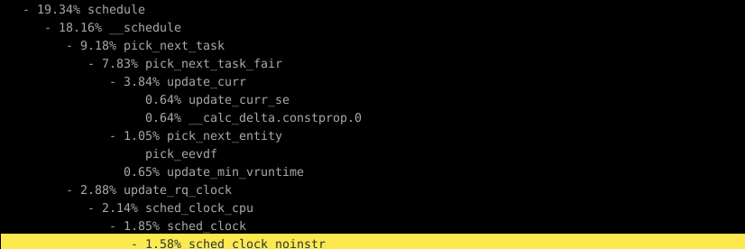

## Linux调度器的整体架构
```shell
调度器架构
│
├── CPU 运行队列 (rq) （每个CPU都有一个）
│   ├── struct rq
│   │   ├── struct cfs_rq   （CFS 调度类的运行队列）
│   │   │   ├── struct rb_root_cached   （红黑树根节点，用于管理CFS任务）
│   │   │   │   ├── struct sched_entity    （调度实体，每个CFS任务的表示）
│   │   │   │   │   ├── struct task_struct （关联的进程）
│   │   │   │   │   ├── u64 vruntime       （虚拟运行时间，决定调度顺序）
│   │   │   │   │   └── struct rb_node     （红黑树节点，用于排序）
│   │   │   │   └── 其他调度实体 ...
│   │   │   └── tasks_timeline （任务时间线，通过 vruntime 排序）
│   │   │
│   │   ├── struct rt_rq    （实时调度类的运行队列）
│   │   │   ├── struct highest_prio （最高优先级的任务）
│   │   │   ├── struct task_struct  （关联的实时任务）
│   │   │   └── 其他优先级队列...
│   │   │
│   │   ├── struct dl_rq    （Deadline 调度类的运行队列）
│   │   │   ├── struct rb_root_cached   （红黑树根节点，用于管理DL任务）
│   │   │   ├── struct sched_dl_entity  （Deadline调度实体）
│   │   │   │   ├── struct task_struct  （关联的进程）
│   │   │   │   └── struct rb_node      （红黑树节点，用于排序）
│   │   │   └── 其他DL任务...
│   │
│   ├── struct task_struct *idle （空闲任务，用于CPU空闲时）
│   └── struct task_struct *stop （停止任务，特定情况下触发）
│
├── 调度类 (sched_class)
│   ├── struct sched_class 
│   │   ├── enqueue_task()      （将任务加入运行队列的函数）
│   │   ├── dequeue_task()      （从运行队列移除任务的函数）
│   │   ├── pick_next_task()    （选择下一个任务执行的函数）
│   │   └── 其他调度相关函数...
│
├── 负载均衡 (sched_domain)
│   ├── struct sched_domain    （调度域，多个 CPU 组成一个调度域）
│   │   ├── struct cpumask     （CPU mask，定义哪些CPU属于该调度域）
│   │   ├── load_balance()     （负载均衡函数）
│   │   ├── select_task_rq()   （选择哪个CPU来运行某个任务）
│   │   └── 其他负载均衡相关函数...
│
└── 全局调度状态
    ├── 运行中的 task_struct
    │   ├── 当前正在运行的任务 (struct task_struct)
    │   └── 下一个即将调度的任务 (next task)
    │
    └── 调度信息
        ├── context_switches   （上下文切换次数）
        ├── nr_running         （当前运行队列中的任务数）
        └── preempt_count      （抢占计数，决定是否可以抢占）
```
1. CPU 运行队列 (rq)：
   - 每个 CPU 都有一个独立的 rq（运行队列），用于管理该 CPU 上的所有任务
   - 每个 rq 包含多个调度类队列（如 cfs_rq、rt_rq 和 dl_rq），用于不同类型的任务（CFS、实时、Deadline 调度类）
   - 每个调度类有其特定的数据结构来管理任务，如 struct cfs_rq 使用红黑树管理 CFS 任务，
   struct rt_rq 使用优先级队列管理实时任务，struct dl_rq 使用红黑树管理 Deadline 任务
2. 调度类 (sched_class)：
   - 不同的调度类实现不同的调度策略。比如，CFS 使用完全公平调度算法，实时调度 使用优先级调度，Deadline调度 则基于任务的截止时间
   - 每个调度类通过实现一组函数（如 enqueue_task()、dequeue_task() 和 pick_next_task()）来定义如何调度进程
3. 负载均衡 (sched_domain)：
   - 在多核系统中，多个 CPU 组成一个调度域（sched_domain），通过负载均衡确保任务在多个 CPU 之间均匀分布
   - 调度域通过 cpumask 来定义哪些 CPU 属于该域，并通过 load_balance() 函数来实现 CPU 之间的任务分配
4. 全局调度状态：
   - 包含所有当前运行中的任务信息和调度器的状态信息，如上下文切换次数、当前 CPU 的任务数等
   - nr_running 表示当前正在 rq 中等待运行的任务数，preempt_count 用于决定当前任务是否可以被抢占

## 调度策略和调度类
### 调度策略
```c
#define SCHED_NORMAL		0
#define SCHED_FIFO		1
#define SCHED_RR		2
#define SCHED_BATCH		3
#define SCHED_IDLE		5
#define SCHED_DEADLINE		6
```
1. SCHED_NORMAL (也称为 SCHED_OTHER，值为 0)：CFS调度器
   - Linux 中的默认调度策略，适用于大多数进程。它是一个时间共享调度策略，也就是基于优先级和时间片的调度策略
   - 使用 vruntime（虚拟运行时间）来决定调度顺序，尽可能公平地为所有进程分配 CPU。
   - 适用于普通的用户进程，如桌面应用、后台服务等。
2. SCHED_FIFO (值为 1)：RT调度器
   - FIFO（先入先出）调度算法。该策略适用于需要严格的实时调度的任务，优先级高的任务可以长时间占据 CPU，除非有更高优先级的任务出现
   - 当有更高优先级的任务进入系统时，当前任务会被抢占
   - 但是，同优先级的任务不会抢占它，它会一直运行到主动让出 CPU（比如调用 sched_yield()）或进入等待状态
3. SCHED_RR (Round Robin, 值为 2)：RT调度器策
   - 基于固定优先级的时间片轮转调度。优先级相同的任务按轮转的方式获取 CPU，每个任务运行一个时间片后，调度器会切换到下一个任务
   - SCHED_RR 提供了相对公平的实时调度，不同于 SCHED_FIFO，每个相同优先级的任务都能在一定时间内执行
4. SCHED_BATCH (值为 3)：CFS调度器
   - 适用于不重要的、对响应时间要求不高的批处理任务。设计目标是降低批处理任务对交互性任务（如桌面应用）的影响
   - 基于 CFS 的调度算法，但优先级较低，CPU 分配较少
   - 适用于低优先级的批处理任务，如大规模数据处理、后台计算等。这类任务不要求快速响应
5. SCHED_IDLE (值为 5)：CFS-IDLE
   - 空闲调度策略，是最低优先级的调度策略，任务仅在系统空闲时运行，通常用于最低优先级的后台任务
   - 适用于系统维护任务、后台数据处理等，这些任务可以在 CPU 空闲时运行
6. SCHED_DEADLINE (值为 6)：DL调度器
   - Linux 提供的硬实时调度策略，用于需要保证在某个特定时间内完成的任务
   - 基于 EDF（Earliest Deadline First，最早截止时间优先）算法，系统会优先调度最接近截止时间的任务

### 调度类
对应上面的调度策略，都有相应的调度器，在讲具体调度类之前，先看看sched_class本身
```shell
sched_class 
│
├── 基本操作函数
│   ├── enqueue_task(rq, task, flags)        - 将任务加入运行队列
│   ├── dequeue_task(rq, task, flags)        - 将任务从运行队列移除
│   ├── yield_task(rq)                       - 当前任务主动让出 CPU
│   ├── yield_to_task(rq, task)              - 允许指定任务抢占当前任务
│   ├── wakeup_preempt(rq, task, flags)      - 任务唤醒时判断是否抢占当前任务
│   ├── pick_next_task(rq)                   - 选择下一个执行的任务
│   └── put_prev_task(rq, task)              - 将当前任务切换出去时的处理
│
├── 多处理器相关操作 (SMP)
│   ├── balance(rq, prev, rq_flags)          - 多 CPU 系统中负载均衡
│   ├── select_task_rq(task, cpu, flags)     - 选择任务应该在哪个 CPU 运行
│   ├── migrate_task_rq(task, new_cpu)       - 迁移任务到新的 CPU
│   ├── task_woken(rq, task)                 - 任务被唤醒时的处理
│   ├── set_cpus_allowed(task, ctx)          - 设置任务允许在哪些 CPU 上运行
│   ├── rq_online(rq)                        - 某个 CPU 被启用时调用
│   └── rq_offline(rq)                       - 某个 CPU 被停用时调用
│
├── 时间片管理和任务管理
│   ├── task_tick(rq, task, queued)          - 每次时钟中断更新任务状态
│   ├── task_fork(task)                      - 新任务被创建时的处理
│   ├── task_dead(task)                      - 任务退出时的处理
│
├── 任务切换
│   ├── switching_to(rq, task)               - 准备切换到某个任务时的操作
│   ├── switched_from(rq, task)              - 从当前任务切换出去时的处理
│   ├── switched_to(rq, task)                - 切换到某个任务时的处理
│
├── 优先级管理
│   ├── reweight_task(rq, task, newprio)     - 任务的权重或优先级改变时的处理
│   └── prio_changed(rq, task, oldprio)      - 任务优先级发生变化时的处理
│
├── 特定调度策略支持
│   ├── get_rr_interval(rq, task)            - 获取 SCHED_RR 调度策略下的时间片长度
│   ├── update_curr(rq)                      - 更新当前任务的调度信息
│   └── task_change_group(task)              - 任务切换到不同调度组时的处理
│
└── 核心调度功能
    ├── 调度器在任务运行、任务创建、任务结束等场景下，执行适当的行为
    ├── 支持抢占式调度、轮转调度、实时调度、批处理等多种调度策略
    └── 通过多处理器负载均衡、CPU 亲和性、优先级管理，优化多核环境的性能
```
但实际的代码中，这个sched_class的作用更像是c++中的虚类，提供了一个模板，然后不同的调度类对于其中的接口有着不同的实现方式

总的来说，有下面这几种调度类，从上到下，优先级从高到低
```c
#define SCHED_DATA                \
    STRUCT_ALIGN();               \
    __sched_class_highest = .;    \
    *(__stop_sched_class)         \
    *(__dl_sched_class)           \
    *(__rt_sched_class)           \
    *(__fair_sched_class)         \
    *(__ext_sched_class)          \
    *(__idle_sched_class)         \
    __sched_class_lowest = .;
```
- __stop_sched_class：主要功能是用于停止任务的调度，任务优先级最高，一般由内核在停用或重启 CPU 时使用
- __dl_sched_class (Deadline 调度类)：实现了Deadline 调度策略（即 SCHED_DEADLINE）
- __rt_sched_class (实时调度类)： 实现了 Linux 的实时调度策略（即 SCHED_FIFO 和 SCHED_RR）
- __fair_sched_class (完全公平调度类)：实现了 Linux 的完全公平调度器（CFS，即 SCHED_NORMAL）， Linux 的默认调度策略，适用于大多数用户进程
- __ext_sched_class (扩展调度类)：在近期加入内核，基于eBPF实现，具体是利用sched_ext，它提供了一套接口，实现了调度器的用户态设计
- __idle_sched_class (空闲调度类)： 实现了空闲调度策略（SCHED_IDLE）。该类的任务是最低优先级的任务，只有在系统没有其他任务运行时才会调度这些空闲任务

## CFS调度
CFS 的核心思想是基于虚拟运行时间（vruntime），通过红黑树管理任务队列，优先调度虚拟运行时间最短的任务，从而实现 "完全公平" 的调度。

### CFS 调度的核心思想
   - 虚拟运行时间：每个任务都有一个 vruntime，CFS 使用这个虚拟运行时间来决定任务获得 CPU 的先后顺序。任务运行时，vruntime 增加，
   运行得越多，vruntime 越大。 调度器总是选择 vruntime 最小的任务运行，这样可以确保 CPU 时间的公平分配
   - 优先级影响：任务的优先级会影响其 vruntime 的增长速度。优先级低的任务，vruntime 增长得快，因此被选择到的机会就更少
     - 消耗的实际时间和vruntime，与高低优先级的关系，简单联想就是“天上一天，地下一年”
   - 红黑树结构：CFS 通过红黑树（rb_tree）来管理所有的就绪任务。能确保操作的时间复杂度为 O(log N)。
   CFS 中，红黑树的每个节点对应一个任务，按 vruntime 排序

### vruntime与优先级
在具体实现中，是通过以下流程实现的
```c
update_curr()
│
├── 1. 获取当前运行的调度实体 (curr) ： cfs_rq->curr
│
├── 2. 计算实际执行时间 delta_exec ： update_curr_se()
│       └── 如果 delta_exec <= 0，返回
│
├── 3. 计算 vruntime 增量 ： calc_delta_fair(delta_exec, curr)
│       ├── 如果任务的权重与 NICE_0_LOAD 不同
│       │       └── 调用 __calc_delta() 进行调整
│       └── 否则，直接返回 delta_exec
│
├── 4. 更新 vruntime ： curr->vruntime += 调整后的 delta_exec
│
├── 5. 更新截止时间和最小 vruntime ： update_deadline()、update_min_vruntime()
│
└── 6. 对当前任务做额外更新 ： update_curr_task()，account_cfs_rq_runtime()
```
其中会根据calc_delta_fair() 使用调度实体的调度权重来调整执行时间，确保权重大的任务增长 vruntime 的速度慢，从而获得更多的 CPU 时间

对于优先级和权重的关系，具体如下，这里其实对应的也是nice值和权重的关系
```c
const int sched_prio_to_weight[40] = {
 /* -20 */     88761,     71755,     56483,     46273,     36291,
 /* -15 */     29154,     23254,     18705,     14949,     11916,
 /* -10 */      9548,      7620,      6100,      4904,      3906,
 /*  -5 */      3121,      2501,      1991,      1586,      1277,
 /*   0 */      1024,       820,       655,       526,       423,
 /*   5 */       335,       272,       215,       172,       137,
 /*  10 */       110,        87,        70,        56,        45,
 /*  15 */        36,        29,        23,        18,        15,
};
```
对于优先级的部分，task_struct中有prio、static_prio 和 normal_prio
- 静态优先级 (static_prio)
  - 由用户或者内核在任务创建时设定，不会动态改变，但它可以通过修改 nice 值或调度策略来调整
  - 它是直接作用于load_weight和vruntime的
  - 在 Linux 系统中，nice 值可以通过公式映射为static_prio
  - static_prio = MAX_RT_PRIO + (nice + 20)
    - 其中MAX_RT_PRIO为100
    - 这个公式将 nice 值从 -20 到 19 映射为 static_prio 的值从 100 到 139
    - nice = -20 对应 static_prio = 100（最高优先级）
    - nice = 0 对应 static_prio = 120（默认优先级）
    - nice = 19 对应 static_prio = 139（最低优先级）
    - 在sched_entity的load_weight设置时，靠的就是static_prio
    - 而load_weight又影响了vruntime
- 动态优先级 (prio)
  - CFS 调度器会根据系统的负载、任务的运行时间、用户交互性等信息，动态调整 prio 的值
  - prio的值影响了这个任务会不会被选中进行调度运行，优先级越高（prio 值越低），任务获得 CPU 的机会越多
- 默认优先级 (normal_prio)
  - normal_prio 一般等于 static_prio，但在某些情况下（如 real-time 调度）可能不同

总的来说，任务的nice值决定了static_prio，static_prio决定了load_weight，load_weight决定了vruntime。
除了static_prio外，load_weight还可能被下面情况影响
- CFS 组调度（CONFIG_FAIR_GROUP_SCHED）：当启用 CFS 组调度时，任务的调度不再是独立的，而是受其所在调度组的影响

### sched_entity
从cfs_rq开始，其实sched_entity不仅可以是一个任务，也可以是一组任务，即调度组，具体关系如下
```shell
cfs_rq (顶层 CFS 运行队列)
├── rb_root_cached (红黑树，用于存储调度实体)
│   ├── struct sched_entity (任务A)
│   ├── struct sched_entity (任务B)
│   └── struct sched_entity (调度组)
│       └── cfs_rq (嵌套的 CFS 运行队列)
│           ├── rb_root_cached (红黑树，用于存储调度组内的调度实体)
│           │   ├── struct sched_entity (任务C)
│           │   └── struct sched_entity (任务D)
│           └── 其他调度信息 (如 min_vruntime 等)
└── 其他调度信息 (如 min_vruntime 等)
```
对于一个sched_entity，结构如下
```shell
sched_entity
├── load_weight (load)            # 任务的负载权重
├── rb_node (run_node)            # 红黑树节点，用于管理任务调度顺序
├── u64 (deadline)                # 任务的截止时间
├── u64 (min_vruntime)            # 最小虚拟运行时间
├── list_head (group_node)        # 任务组链表节点
├── unsigned int (on_rq)          # 是否在运行队列中
├── u64 (exec_start)              # 任务上次开始运行的时间
├── u64 (sum_exec_runtime)        # 累计执行时间
├── u64 (prev_sum_exec_runtime)   # 上次的累计执行时间
├── u64 (vruntime)                # 虚拟运行时间，用于公平调度
├── s64 (vlag)                    # 虚拟时延标志
├── u64 (slice)                   # 任务的时间片
├── u64 (nr_migrations)           # 迁移次数
├── fair group scheduling (CONFIG_FAIR_GROUP_SCHED)
│   ├── int (depth)               # 调度组层次深度
│   ├── sched_entity* (parent)    # 父调度实体指针
│   ├── cfs_rq* (cfs_rq)          # 所属 CFS 运行队列
│   ├── cfs_rq* (my_q)            # 任务组的 CFS 运行队列
│   └── unsigned long (runnable_weight) # 任务组的可运行权重
└── SMP configuration (CONFIG_SMP)
    └── sched_avg (avg)           # 平均负载信息
```
- 当调度实体是一个调度组时，该调度组的 vruntime 反映的是组内所有任务的综合表现，调度器将整个组视为一个调度实体，计算其 vruntime 来决定它与其他任务或组的相对调度顺序
- 这种嵌套可以继续下去，也就是说，调度组内还可以包含子调度组。调度器在做任务选择时，会沿着这条嵌套路径逐层深入，最终选择一个具体的任务进行执行


### CFS的整体调度流程
从schedule函数出发，看看这一路都经历了什么

这是利用perf对系统进行监控期间得到的数据，这里schedule的调用链给出了其中完整的调用流程
- schedule() ：Linux 内核中的核心调度函数，用于将当前运行的任务切换到另一个可运行的任务
- __schedule() 是 schedule() 的具体实现，而其中最重要的就是pick_next_task()
- pick_next_task() 用于从运行队列中挑选下一个任务，选择逻辑依赖于当前调度器的实现
  - pick_next_task()中其实是靠__pick_next_task实现
  - 首先是判断当前队列任务是不是都是CFS调度类的，是的话就直接pick_next_task_fair() 从 CFS 调度队列中挑选下一个任务
    - 如果pick_next_task_fair()没有就进入idle
  - 不是的话就要进入restart，put_prev_task_balance() 会平衡前一个任务的负载并将其放入合适的位置
  - 之后遍历调度类
    - 遍历优先级上面提到过了，从__stop_sched_class到__idle_sched_class找到第一个活跃的调度类，利用它的pick_next_task找到下一个任务
    - 后面一步这里是启用了sched_ext的情况，就先不展开说了
```c
for_each_active_class(class) {
    p = class->pick_next_task(rq);
    if (p) {
        scx_next_task_picked(rq, p, class);
        return p;
    }
}
```
- pick_next_task_fair之中，最重要的就update_curr(cfs_rq)和pick_next_entity(cfs_rq)
  - update_curr的代码原理上面说过了，但这边因为是选择具体任务，所以会有一个循环，不断pick_next_entity深入调度实体，直到它是一个任务而非调度组
  - 对于新旧调度实体的维护，cfs_rq就是一个树，所谓嵌套、调度组可以理解为在某个叶子节点上再拓展出个树
    - 找出旧调度实体的叶子节点删除
    - 新调度实体一定隶属再这个树中，找到对应的节点（调度实体），加入到对应的cfs_rq的红黑树中即可
- 之后再__schedule()中，就会进行具体的上下文切换context_switch

### 上下文切换
对于上下文切换，涉及地址空间等一系列操作，这里给出几个不同的情况
1. 用户线程到内核线程
   - 用户线程发起系统调用或发生中断时，从用户态切换到内核态来执行内核代码
   - 进入延迟 TLB 模式： 调用 enter_lazy_tlb()，标记为延迟 TLB 刷新模式。这是因为内核线程不需要频繁切换页表，所以可以延迟 TLB 刷新，直到必要时才执行
     - 结合情况分析，系统调用回去还是在之前用户环境操作，没必要刷新
   - 内核线程没有用户地址空间，所以这部分把之前prev的用户地址空间暂存个，保存指针有效性，当个占位的
   - 由于不涉及虚拟内存的切换，因此这个上下文切换开销可以说是最低的

2. 同进程间的线程切换
   - 不需要切换页表：地址空间相同，next->mm 和 prev->mm 相同，意味着两个线程共享同一个 mm_struct，不需要调用 switch_mm() 切换页表
   - 切换线程的上下文： 主要涉及寄存器状态和栈的切换。调用 switch_to() 切换寄存器和栈，这些都是线程级的
   - 其他状态更新： 调用 switch_mm_cid()，更新一些与 CPU 相关的状态（如性能计数器、线程上下文）
   - 进程中线程共享进程的全局资源，如打开的文件描述符、全局变量等。这意味着线程切换时不需要对这些资源进行重新分配或管理，大大减少了上下文切换的复杂性

3. 不同进程间的线程切换
   - 切换内存地址空间： 调用 switch_mm_irqs_off() 切换内存地址空间，更新页表。这是必要的，因为新任务的地址空间和旧任务不同
   - 更新 TLB 和内存屏障： 调用 membarrier_switch_mm() 执行必要的内存屏障操作，以确保内存访问的一致性。同时调用 lru_gen_use_mm() 更新新任务的内存访问统计
   - 完成寄存器和栈的切换： 调用 switch_to() 切换寄存器状态和栈
   - 这个切换不仅开销最大，同时副作用也很大
     - 缓存失效：每次切换进程，当前 CPU 缓存（L1、L2、L3 缓存）中的数据可能已经与新进程无关。因此，在加载新进程时，
       CPU 可能需要重新从主存中获取数据。这会导致缓存未命中
     - 页表切换：虚拟内存的切换涉及到页表的刷新。因为每个进程都有自己的地址空间，切换进程时，MMU 需要更新页表以反映新的地址空间。
       页表切换涉及到 TLB（Translation Lookaside Buffer）的刷新，这会增加内存访问的延迟


## 抢占
### 时钟中断
时钟中断周期性地检查当前任务是否时间片耗尽。如果时间片耗尽，会触发任务切换

- 时钟中断处理函数内会调用 sched_tick()
  - 这个函数先取出当前 cpu 的rq，然后得到这个队列上当前正在运行中的进程的 task_struct，然后调用这个 task 的调度类的 task_tick 函数
- 对于CFS来说，就是task_tick_fair
```c
for_each_sched_entity(se) {
		cfs_rq = cfs_rq_of(se);
		entity_tick(cfs_rq, se, queued);
	}
```
- 根据当前进程的 task，找到对应的 sched_entity 和 cfs_rq ，调用 entity_tick
- 在entity_tick中
  - 首先就是update_curr(cfs_rq)
  - update_load_avg() 和 update_cfs_group() 用于更新任务的负载均衡信息
    - 虽然这些更新操作本身并不直接触发抢占，但它们会影响调度实体的排序和优先级计算，从而间接影响任务抢占的决策
  - resched_curr() 函数是与抢占直接相关的操作。它会设置当前任务的 TIF_NEED_RESCHED 标志，标记当前任务需要重新调度
    - 但是此时此刻，并不真的抢占，而是打上一个标签 TIF_NEED_RESCHED
```c
static void
entity_tick(struct cfs_rq *cfs_rq, struct sched_entity *curr, int queued)
{
	/*
	 * Update run-time statistics of the 'current'.
	 */
	update_curr(cfs_rq);

	/*
	 * Ensure that runnable average is periodically updated.
	 */
	update_load_avg(cfs_rq, curr, UPDATE_TG);
	update_cfs_group(curr);

#ifdef CONFIG_SCHED_HRTICK
	/*
	 * queued ticks are scheduled to match the slice, so don't bother
	 * validating it and just reschedule.
	 */
	if (queued) {
		resched_curr(rq_of(cfs_rq));
		return;
	}
	/*
	 * don't let the period tick interfere with the hrtick preemption
	 */
	if (!sched_feat(DOUBLE_TICK) &&
			hrtimer_active(&rq_of(cfs_rq)->hrtick_timer))
		return;
#endif
}
```
### 高优先级任务被唤醒
如果一个更高优先级的任务被唤醒（例如一个 I/O 完成，某个阻塞的进程变为可执行状态），那么当前正在运行的任务会被抢占，系统会立刻切换到高优先级任务
- 当一个进程需要被唤醒时，try_to_wake_up() 是内核用来唤醒任务的主要函数
  - 该函数负责将任务从不可执行状态（如睡眠状态）转变为可执行状态，并将其放入运行队列中
  - 更新任务的状态，并检查唤醒的任务是否可以抢占当前正在运行的任务
- try_to_wake_up() 调用 ttwu_queue 将这个唤醒的任务添加到队列当中，ttwu_queue 再调用 ttwu_do_activate 激活这个任务
- 在ttwu_do_activate中，activate_task(rq, p, en_flags)是真正实现加入队列的，之后wakeup_preempt(rq, p, wake_flags)中也调用了resched_curr()

相当于这边也主要是置位操作，实际的抢占也没有发生

### 抢占的时机
对于用户态的抢占来说，通常是在时钟中断或者系统调用返回用户态前触发抢占
- 时钟中断
  - 时钟中断触发时调用 do_IRQ()
  - 中断处理后根据当前执行的任务状态决定下一步动作
  - 返回用户态时，用 exit_to_usermode_loop()，检查 _TIF_NEED_RESCHED 标志位，触发 schedule() 进行调度
- 系统调用
  - 系统调用结束时会检查 _TIF_NEED_RESCHED 标志
  - 如果需要重新调度，则调用 schedule() 切换任务

对于内核态的抢占来说，发生在执行内核态代码的过程中，通常是某个任务占用过多 CPU 时间，或者另一个高优先级任务唤醒
- 抢占的执行点
  - preempt_enable()：如果调用时发现 _TIF_NEED_RESCHED 标志已置位，会触发抢占
    - 具体来说是preempt_schedule->preempt_schedule_common->__schedule 进行调度
  - 在内核态也会遇到中断的情况，当中断返回的时候，返回的仍然是内核态，这个时候也是一个执行抢占的时机
  - 中断处理完毕后会检查 _TIF_NEED_RESCHED 标志，通过 preempt_schedule_irq() 触发调度


## 总结
现在重新返回__schedule()函数，会发现有下面这俩行代码来清除抢占标志位
```c
clear_tsk_need_resched(prev);
clear_preempt_need_resched();
```
抢占标志位 (_TIF_NEED_RESCHED 和 _TIF_PREEMPT_NEED_RESCHED) 在调用 pick_next_task() 之前就已经被清除了
- 抢占标志位的作用：通知调度器需要进行调度的标志。当任务因为时间片用尽或有高优先级任务唤醒时，这些标志位会被设置。
当 __schedule() 被调用时，意味着系统已经检测到有调度需求，标志位的作用在这个时候已经完成。


现在返回调度类，在深入讲讲那些基本的操作函数都干了什么
- enqueue_task(rq, task, flags)
  - 将一个任务加入到调度器的运行队列 (rq) 中，使其成为可调度状态
- dequeue_task(rq, task, flags)
  - 将一个任务从运行队列中移除，使其不再参与调度
- wakeup_preempt(rq, task, flags)
  - 通常伴随的任务状态的改变和入队操作 
  - 根据唤醒任务的优先级与当前任务的比较，决定是否需要抢占
  - 如果唤醒任务的优先级更高，则设置 _TIF_NEED_RESCHED 标志，触发调度
- pick_next_task(rq)
  - 从运行队列中选择下一个要执行的任务

从CPU的rq开始，当切换任务时候，一路都经历了什么
1. 调度类的选择和遍历
2. 从对应的调度类中，选择对应的队列进行调度
3. 对应的调度队列中，更新上一个任务的状态，选出下一个要运行的调度实体，再在调度实体中找到下一个运行的任务
4. 之后上下文切换

而发生上面事情的时机，就是抢占。


