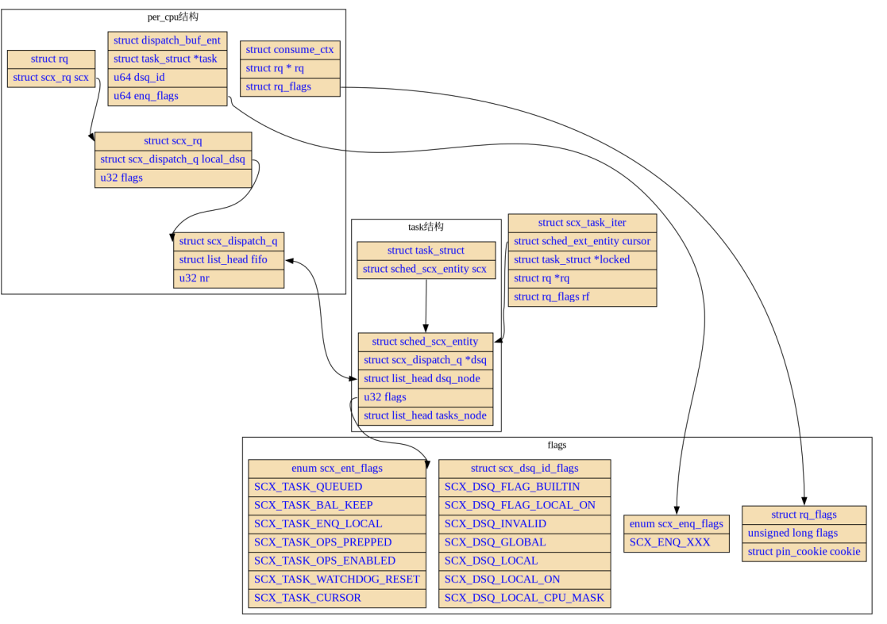

## sched_ext介绍
sched_ext 已经在 Linux 6.12 内核中合并，sched_ext 允许通过 BPF（Berkeley Packet Filter）编写自定义调度策略，
使得调度器的行为可以灵活调整。这一扩展使得内核可以动态地加载和卸载调度算法，从而无需修改内核代码即可实现不同的调度策略。

sched_ext 的引入意味着可以使用 BPF 程序在用户空间实现各种调度算法，并通过 struct sched_ext_ops 来定义调度行为。
这种方式使得开发者可以创建更灵活和高效的调度策略。
例如，调度器可以动态分配任务到 CPU、创建自定义的调度队列（DSQ），甚至可以根据不同的应用场景为任务分配优先级

通过 sched_ext，开发者可以更好地控制任务的调度行为，例如调优实时系统的性能、实现多级优先级调度策略或特殊的 CPU 负载平衡算法。
此次合并也标志着调度策略的一个重要转变，即从传统的内核模块实现转向用户态 BPF 实现，使得调度策略的开发和迭代变得更加快速和安全

官方的GitHub库在这里
https://github.com/sched-ext/scx/tree/main

在本次介绍之前，最好对Linux调度器的架构有一定的了解，
这里分别是对task_struct的介绍https://zhuanlan.zhihu.com/p/1114115706
和对Linux调度器的介绍https://zhuanlan.zhihu.com/p/1583765020


## sched_ext相关组件
总的来说，SCX机制涉及的代码文件主要在三个地方
- include/linux/sched/ext.h
  - 内核与用户的接口文件, 定义了绝大多数的函数接口
- kernel/sched/ext.c
  - 内核拓展调度器核心代码
- tools/sched_ext
  - 实现的 SCX 调度器的例子

### sched_ext整体架构
DEFINE_SCHED_CLASS是内核实现调度类时候用到的宏，类比可以想成是对sched_class这个虚类的具体实现，常见的cfs、rt、dl调度器实现都用到了DEFINE_SCHED_CLASS，
而ext就是内核最新加入的“扩展调度器”
```c
DEFINE_SCHED_CLASS(ext) = {
	.enqueue_task        = enqueue_task_scx, // 将任务加入调度队列。
	.dequeue_task        = dequeue_task_scx, // 从调度队列中移除任务。
	.yield_task          = yield_task_scx, // 当前任务让出 CPU。
	.yield_to_task       = yield_to_task_scx, // 让出 CPU 给特定任务。

	.wakeup_preempt      = wakeup_preempt_scx, // 唤醒任务时的抢占逻辑。

	.balance             = balance_scx, // 负载均衡操作。
	.pick_task           = pick_task_scx, // 选择下一个要运行的任务。

	.put_prev_task       = put_prev_task_scx, // 将当前任务切换出 CPU。
	.set_next_task       = set_next_task_scx, // 设置要运行的下一个任务。

#ifdef CONFIG_SMP
	.select_task_rq      = select_task_rq_scx, // 在多处理器系统中选择任务运行队列。
	.task_woken          = task_woken_scx, // 当任务被唤醒时调用。
	.set_cpus_allowed    = set_cpus_allowed_scx, // 设置任务可以运行的 CPU 集。

	.rq_online           = rq_online_scx, // 运行队列上线时的处理。
	.rq_offline          = rq_offline_scx, // 运行队列下线时的处理。
#endif

	.task_tick           = task_tick_scx, // 定时器周期内的任务更新。

	.switching_to        = switching_to_scx, // 切换到新的调度类时调用。
	.switched_from       = switched_from_scx, // 从当前调度类切换走时调用。
	.switched_to         = switched_to_scx, // 切换到当前调度类时调用。
	.reweight_task       = reweight_task_scx, // 调整任务的权重（优先级）。
	.prio_changed        = prio_changed_scx, // 任务的优先级发生变化时调用。

	.update_curr         = update_curr_scx, // 更新当前任务的运行状态。

#ifdef CONFIG_UCLAMP_TASK
	.uclamp_enabled      = 1, // 启用任务的 Uclamp 支持（用户空间的 CPU 频率限制）。
#endif
};
```
上面的一系列调度类中的成员函数，都可以利用sched_ext实现用户态的自定义，具体来说，在sched_ext 的设计架构中, 
任意一个对结构体struct sched_ext_ops 的实现都可以被载入内核作为调度器，该结构体位于 include/linux/sched/ext.h 中

```c
struct sched_ext_ops {
	s32 (*select_cpu)(struct task_struct *p, s32 prev_cpu, u64 wake_flags); // Selects the target CPU for a waking task.
	void (*enqueue)(struct task_struct *p, u64 enq_flags); // Adds a task to the BPF scheduler's queue.
	void (*dequeue)(struct task_struct *p, u64 deq_flags); // Removes a task from the BPF scheduler's queue.
	void (*dispatch)(s32 cpu, struct task_struct *prev); // Dispatches tasks or consumes dispatch queues when a CPU is idle.
	void (*tick)(struct task_struct *p); // Periodic callback for task scheduling based on timer ticks.
	bool (*yield)(struct task_struct *from, struct task_struct *to); // Handles task yielding to another task or general yielding.
	void (*cpu_acquire)(s32 cpu, struct scx_cpu_acquire_args *args); // Called when a CPU becomes available to the scheduler.
	void (*cpu_release)(s32 cpu, struct scx_cpu_release_args *args); // Called when a CPU is released from the scheduler.
	s32 (*init_task)(struct task_struct *p, struct scx_init_task_args *args); // Initializes a task for BPF scheduling.
	void (*exit_task)(struct task_struct *p, struct scx_exit_task_args *args); // Cleans up after a task exits.
	void (*enable)(struct task_struct *p); // Enables BPF scheduling for a task.
	void (*disable)(struct task_struct *p); // Disables BPF scheduling for a task.
    
    ...
    
	void (*cpu_online)(s32 cpu); // Called when a CPU becomes online.
	void (*cpu_offline)(s32 cpu); // Called when a CPU goes offline.
	s32 (*init)(void); // Initializes the BPF scheduler.
	void (*exit)(struct scx_exit_info *info); // Cleans up the BPF scheduler on exit.
    u64 flags; // Scheduler flags that define behavior.
    
    ...
    
	char name[SCX_OPS_NAME_LEN]; // Name of the BPF scheduler.
};
```
对于对于 scx 机制而言, 唯一必须的字段只有.name 字段, 并要求是一个合法的 BPF 对象名称, 而其余所有的 operation 均是可选的，内核中有默认实现，
对应的默认实现就是DEFINE_SCHED_CLASS(ext)中对应的函数

## sched_ext与内核的交互
先从整体的来看，在管理task的范围来看，在上面的sched_ext的调度类定义中，有个flags，当flags设置为SCX_OPS_SWITCH_PARTIAL时候，
此时调度的任务进为仅限于 SCHED_EXT 类型的任务，否则所有 SCHED_NORMAL、SCHED_BATCH、SCHED_IDLE 和 SCHED_EXT 任务都由 sched_ext 调度。
相当于把原来cfs的管辖范围的任务都挪用到sched_ext里了

sched_ext的整体架构如下所示


### local DSQ和global DSQ
同其他调度器类似，在CPU的运行队列rq中也有个sched_ext的运行队列scx_rq，但之后的部分，对比cfs的架构，要简单的多，在sched_ext中真正负责维护调度队列的，
是scx_dispatch_q的结构
```c
 * A dispatch queue (DSQ) can be either a FIFO or p->scx.dsq_vtime ordered
 * queue. A built-in DSQ is always a FIFO. The built-in local DSQs are used to
 * buffer between the scheduler core and the BPF scheduler. See the
 * documentation for more details.
 */
struct scx_dispatch_q {
	raw_spinlock_t		lock;
	struct list_head	list;	/* tasks in dispatch order */
	struct rb_root		priq;	/* used to order by p->scx.dsq_vtime */
	u32			nr;
	u32			seq;	/* used by BPF iter */
	u64			id;
	struct rhash_head	hash_node;
	struct llist_node	free_node;
	struct rcu_head		rcu;
};
```
这个结构也很简单，最重要的就个list_head，它存的是下一个要指向的任务，相当于一个链表维护了运行队列，是一个FIFO结构，这个结构是per-CPU的，
相当于是个local DSQ，与之对应的，全局也有一个global DSQ
```c
/*
 * Dispatch queues.
 *
 * The global DSQ (%SCX_DSQ_GLOBAL) is split per-node for scalability. This is
 * to avoid live-locking in bypass mode where all tasks are dispatched to
 * %SCX_DSQ_GLOBAL and all CPUs consume from it. If per-node split isn't
 * sufficient, it can be further split.
 */
static struct scx_dispatch_q **global_dsqs;
```
- 全局调度队列（Global DSQ）用于存放所有待调度的任务。所有 CPU 都可以从这个队列中获取任务来执行
- 为了提高可扩展性并防止在绕过模式（bypass mode）下发生活锁，将全局调度队列按节点拆分。这种拆分有助于避免所有任务都排入同一个队列导致的竞争问题
- 多个按节点划分的global DSQ。这些队列为不同的节点分配独立的任务队列，减少了竞争，提高了调度的并发性能

### task_struct中的sched_ext_entity
每个调度类都有个调度实体来精确到个体任务进行调度，在sched_ext中就是sched_ext_entity
```c
struct sched_ext_entity {
    struct scx_dispatch_q *dsq; // 任务所属的调度队列（DSQ）。
    struct scx_dsq_list_node dsq_list; // dsq_list 用于维护任务在这DSQ队列中的位置
    struct rb_node dsq_priq; // 按虚拟时间（vtime）排序的红黑树节点。
    u32 dsq_seq; // DSQ 的调度序列号。
    u32 dsq_flags; // DSQ 锁保护的标志位。
    u32 flags; // 运行队列（RQ）锁保护的标志位。
    u32 weight; // 任务的权重，用于优先级计算。
    s32 sticky_cpu; // 偏好 CPU，表示任务倾向于在哪个 CPU 上执行。
    s32 holding_cpu; // 当前任务实际占用的 CPU。
    u32 kf_mask; // 特殊调用操作的掩码。
    struct task_struct *kf_tasks[2]; // 与调用操作相关的任务指针。
    atomic_long_t ops_state; // 操作状态的原子变量。

    struct list_head runnable_node; // 用于将任务加入到运行队列的可运行任务链表中。运行队列（runqueue, rq）是一个 CPU 级别的结构，用于管理当前可以调度的任务
    unsigned long runnable_at; // 任务变为可运行状态的时间。

#ifdef CONFIG_SCHED_CORE
    u64 core_sched_at; // 核心调度的时间戳，用于优先级比较。
#endif
    u64 ddsp_dsq_id; // 延迟调度时的 DSQ ID。
    u64 ddsp_enq_flags; // 延迟调度时的入队标志。

    /* BPF 调度器可修改的字段 */
    
    u64 slice; // 任务的运行预算（时间片），以纳秒为单位，自动递减。
    
    u64 dsq_vtime; // 在 DSQ 的 vtime 优先级队列中的排序值。

    bool disallow; // 拒绝将任务切换到 SCHED_EXT 策略的标志。

    /* 冷字段 */
#ifdef CONFIG_EXT_GROUP_SCHED
    struct cgroup *cgrp_moving_from; // 正在迁移的 cgroup。
#endif
    struct list_head tasks_node; // 链表节点，用于任务的管理（必须是最后一个字段）。
};
```
介绍基本都在注释里了，要注意的就是几个list_node，分别scx_dsq_list_node dsq_list记录任务在DSQ的位置，
还有list_head runnable_node用于记录rq当前运行的任务，方便schedule时候的操作

剩下的操作随着其中函数的讲解再来说明

### 重要函数
之后为了方便，sched_ext都简写为scx 
#### pick_task_scx
从__pick_next_task进入来看
```c
for_each_active_class(class) {
		if (class->pick_next_task) {
			p = class->pick_next_task(rq, prev);
			if (p)
				return p;
		} else {
			p = class->pick_task(rq);
			if (p) {
				put_prev_set_next_task(rq, prev, p);
				return p;
			}
		}
	}
```
在遍历调度类时候，可以发现scx就在cfs的下面
```c
#define SCHED_DATA                \
    STRUCT_ALIGN();               \
    __sched_class_highest = .;    \
    *(__stop_sched_class)         \
    *(__dl_sched_class)           \
    *(__rt_sched_class)           \
    *(__fair_sched_class)         \
    *(__ext_sched_class)          \
    *(__idle_sched_class)         \
    __sched_class_lowest = .;
```
在上面已经讲过了，当自定义的scx未设置flag时候，cfs的任务都会进入scx的队列，此时当遍历到__fair_sched_class会发现cfs队列是空的，进一步就会到scx调度类，
scx的pick_task就是pick_task_scx
```c
static struct task_struct *pick_task_scx(struct rq *rq)
{
	struct task_struct *prev = rq->curr;
	struct task_struct *p;
    
	if ((rq->scx.flags & SCX_RQ_BAL_KEEP) &&
	    prev->sched_class == &ext_sched_class) {
		p = prev;
		if (!p->scx.slice)
			p->scx.slice = SCX_SLICE_DFL;
	} else {
		p = first_local_task(rq);
		if (!p)
			return NULL;

		if (unlikely(!p->scx.slice)) {
			if (!scx_rq_bypassing(rq) && !scx_warned_zero_slice) {
				printk_deferred(KERN_WARNING "sched_ext: %s[%d] has zero slice in %s()\n",
						p->comm, p->pid, __func__);
				scx_warned_zero_slice = true;
			}
			p->scx.slice = SCX_SLICE_DFL;
		}
	}

	return p;
}
```
```shell
获取当前正在运行的任务（prev = rq->curr）
    │
    ├── 检查是否继续运行当前任务（rq->scx.flags & SCX_RQ_BAL_KEEP 且 prev->sched_class == &ext_sched_class）
    │       │
    │       ├── 是：将 p 设置为 prev，并检查时间片（p->scx.slice）
    │       │       │
    │       │       ├── 如果时间片为零，则重置为默认时间片（SCX_SLICE_DFL）
    │       │       │
    │       │       └── 返回 p
    │       │
    │       └── 否：从本地 DSQ 中获取第一个任务（p = first_local_task(rq)）
    │               │
    │               ├── 如果 p 为 NULL，则返回 NULL（无可调度任务）
    │               │
    │               └── 检查时间片（p->scx.slice）
    │                       │
    │                       ├── 如果时间片为零，发出警告并重置为默认时间片（SCX_SLICE_DFL）
    │                       │
    │                       └── 返回 p
    │
返回选中的任务（p）
```

#### consume_global_dsq
可以看到pick_task_fair中并没有涉及共享DSQ的任务，而负责将任务在DSQ间转移的，有下面这些函数
```c
static bool consume_global_dsq(struct rq *rq)
{
	int node = cpu_to_node(cpu_of(rq));

	return consume_dispatch_q(rq, global_dsqs[node]);
}
```
这个函数中，核心的实现的consume_dispatch_q，consume_dispatch_q 函数的主要目的是从给定的调度队列（dsq）中尝试消费一个任务并将其分配到指定的运行队列（rq），
在consume_dispatch_q中，会尝试将global DSQ中的任务都放到rq中，直到成功放上一个任务为止，相当于这个和上面那个配合使用，
当设计调度器不方便直接选择CPU分屏任务时候，可以都将任务分配到global DSQ，之后保证在每次真正调度前都利用这个consume_global_dsq让系统自己分配任务给具体CPU的队列
```c
static bool consume_dispatch_q(struct rq *rq, struct scx_dispatch_q *dsq)
{
	struct task_struct *p;
retry:
	/*
	 * The caller can't expect to successfully consume a task if the task's
	 * addition to @dsq isn't guaranteed to be visible somehow. Test
	 * @dsq->list without locking and skip if it seems empty.
	 */
	if (list_empty(&dsq->list))
		return false;

	raw_spin_lock(&dsq->lock);
    
    // 遍历dsq中的任务p
	nldsq_for_each_task(p, dsq) {
		struct rq *task_rq = task_rq(p);// 找到当前任务的所在的rq
        
		if (rq == task_rq) { // 如果p已经在目标rq上
			task_unlink_from_dsq(p, dsq); // 把任务直接从dsq上扔掉
			move_local_task_to_local_dsq(p, 0, dsq, rq);// 把p移动到目标rq的dsq上
			raw_spin_unlock(&dsq->lock);
			return true;
		}

		if (task_can_run_on_remote_rq(p, rq, false)) { // 如果任务不在目标运行队列上，检查它是否可以在远程运行队列上执行
			if (likely(consume_remote_task(rq, p, dsq, task_rq)))
				return true;
			goto retry;
		}
	}

	raw_spin_unlock(&dsq->lock);
	return false;
}
```

```c
static bool consume_remote_task(struct rq *this_rq, struct task_struct *p,
				struct scx_dispatch_q *dsq, struct rq *src_rq)
{
	raw_spin_rq_unlock(this_rq);

	if (unlink_dsq_and_lock_src_rq(p, dsq, src_rq)) { // 从调度队列（dsq）中解除任务 p 的链接
		move_remote_task_to_local_dsq(p, 0, src_rq, this_rq); // 将任务从源运行队列（src_rq）移动到本地运行队列（this_rq）
		return true;
	} else {
		raw_spin_rq_unlock(src_rq);
		raw_spin_rq_lock(this_rq);
		return false;
	}
}
```
```c
static void move_remote_task_to_local_dsq(struct task_struct *p, u64 enq_flags,
					  struct rq *src_rq, struct rq *dst_rq)
{
	lockdep_assert_rq_held(src_rq);

	/* the following marks @p MIGRATING which excludes dequeue */
	deactivate_task(src_rq, p, 0);// 这里核心就个dequeue_task(rq,p,flags)，将任务p在源rq中移除
	set_task_cpu(p, cpu_of(dst_rq));// 设置task的CPU
	p->scx.sticky_cpu = cpu_of(dst_rq);

	raw_spin_rq_unlock(src_rq);
	raw_spin_rq_lock(dst_rq);

	/*
	 * We want to pass scx-specific enq_flags but activate_task() will
	 * truncate the upper 32 bit. As we own @rq, we can pass them through
	 * @rq->scx.extra_enq_flags instead.
	 */
	WARN_ON_ONCE(!cpumask_test_cpu(cpu_of(dst_rq), p->cpus_ptr));
	WARN_ON_ONCE(dst_rq->scx.extra_enq_flags);
	dst_rq->scx.extra_enq_flags = enq_flags;
	activate_task(dst_rq, p, 0);// 对应的，这里的核心就个equeue_task(rq,p,flags)，将任务p放到目标的rq
	dst_rq->scx.extra_enq_flags = 0;
}
```
总结一下，是个这流程
```c
consume_global_dsq
|
|-- 调用 consume_dispatch_q (目标：global_dsqs[node])  // 尝试从全局调度队列获取任务
    |
    |-- consume_dispatch_q
        |
        |-- 检查 dsq 是否为空
        |   |
        |   |-- 如果为空，返回 false  // 没有任务可消费
        |
        |
        |-- 遍历 dsq 中的任务 p (nldsq_for_each_task)
            |
            |-- 检查任务 p 是否已经在目标 rq 上
            |   |
            |   |-- 如果是，将任务从 dsq 中移除，并移动到 rq 的本地 DSQ
            |   |   | 
            |   |   |-- 调用 task_unlink_from_dsq  // 解除任务与 dsq 的链接
            |   |   |-- 调用 move_local_task_to_local_dsq  // 移动任务到本地队列
            |   |
            |   |-- 释放锁并返回 true  // 成功消费一个任务
            |
            |-- 如果任务 p 不在目标 rq 上，检查是否可以在目标 rq 运行 (task_can_run_on_remote_rq)
                |
                |-- 如果可以，调用 consume_remote_task  // 尝试将任务从源 rq 迁移到目标 rq
                |   |
                |   |-- 释放目标 rq 锁，尝试获取源 rq 的锁 (unlink_dsq_and_lock_src_rq)
                |   |
                |   |-- 如果成功解除任务与 dsq 的链接
                |   |   |
                |   |   |-- 调用 move_remote_task_to_local_dsq  // 将任务从源 rq 移动到目标 rq
                |   |       |
                |   |       |-- deactivate_task  // 从源 rq 移除任务
                |   |       |-- set_task_cpu  // 更新任务的 CPU 设置
                |   |       |-- activate_task  // 将任务添加到目标 rq
                |   |
                |   |-- 返回 true 表示成功消费一个任务
                |
                |-- 如果失败，重新尝试 (goto retry)
        |
        |-- 遍历结束且未找到合适的任务  // 所有任务都无法迁移
            |
            |-- 释放锁并返回 false  // 任务消费失败
```


####   scx_bpf_dispatch
用于将任务分派到指定调度队列（DSQ）的函数。这个函数可以在不同的回调函数中使用，
包括 ops.enqueue()、ops.select_cpu() 和 ops.dispatch()。它的主要功能是将一个任务放入指定的 FIFO 队列，并设置任务的时间片
```c
__bpf_kfunc void scx_bpf_dispatch(struct task_struct *p, u64 dsq_id, u64 slice,
				  u64 enq_flags)
{
	if (!scx_dispatch_preamble(p, enq_flags))
		return;

	if (slice)
		p->scx.slice = slice;
	else
		p->scx.slice = p->scx.slice ?: 1;

	scx_dispatch_commit(p, dsq_id, enq_flags);
}
```
- 首先调用 scx_dispatch_preamble 检查是否满足分派条件。如果不满足，函数会直接返回，不进行任务分派
- 设置任务的时间片 (slice)
  - 如果提供的 slice 值不为零，则将任务的时间片设置为该值。
  - 如果 slice 为零，则保持当前的剩余时间片。如果当前时间片也为零，将其设置为 1，确保任务有时间片可用
- 提交任务到指定的 DSQ (scx_dispatch_commit)

之后实际的任务分派由scx_dispatch_commit完成
```c
static void scx_dispatch_commit(struct task_struct *p, u64 dsq_id, u64 enq_flags)
{
	struct scx_dsp_ctx *dspc = this_cpu_ptr(scx_dsp_ctx);
	struct task_struct *ddsp_task;

	ddsp_task = __this_cpu_read(direct_dispatch_task);
	if (ddsp_task) {
		mark_direct_dispatch(ddsp_task, p, dsq_id, enq_flags);
		return;
	}

	if (unlikely(dspc->cursor >= scx_dsp_max_batch)) {
		scx_ops_error("dispatch buffer overflow");
		return;
	}

	dspc->buf[dspc->cursor++] = (struct scx_dsp_buf_ent){
		.task = p,
		.qseq = atomic_long_read(&p->scx.ops_state) & SCX_OPSS_QSEQ_MASK,
		.dsq_id = dsq_id,
		.enq_flags = enq_flags,
	};
}
```
在其中涉及了scx_dsp_ctx，它主要存储了当前运行队列的分派状态和任务调度信息，要补充的是这个是per-CPU的
```c
struct scx_dsp_ctx {
    struct rq *rq;          // 关联的运行队列（runqueue），表示任务调度的目标队列。
    u32 cursor;             // 分派缓冲区的当前指针，指向缓冲区中下一个可用的条目。
    u32 nr_tasks;           // 当前调度上下文中需要分派的任务数量。
    struct scx_dsp_buf_ent buf[]; // 分派缓冲区的数组，用于存储任务分派信息。
};
```
回到上面的scx_dispatch_commit，它会检查是否存在直接分派的任务，检查是否存在直接分派的任务则调用 mark_direct_dispatch。

之后才是主要部分，检查缓冲区，如果未满就将任务 p 的信息添加到分派缓冲区（dspc->buf）中，并更新 cursor 指针

对于被压到buffer的任务，之后是通过finish_dispatch 和 flush_dispatch_buf 函数把任务具体加入队列的
```c
static void flush_dispatch_buf(struct rq *rq)
{
	struct scx_dsp_ctx *dspc = this_cpu_ptr(scx_dsp_ctx);
	u32 u;

	for (u = 0; u < dspc->cursor; u++) {
		struct scx_dsp_buf_ent *ent = &dspc->buf[u];

		finish_dispatch(rq, ent->task, ent->qseq, ent->dsq_id,
				ent->enq_flags);
	}

	dspc->nr_tasks += dspc->cursor;
	dspc->cursor = 0;
}
```
遍历buffer中的任务，利用finish_dispatch将任务具体分派到队列中，finish_dispatch中会根据任务的状态进行一些判断或预处理，
之后根据DSQ的id，用dispatch_to_local_dsq分派到CPU本地队列或者用dispatch_enqueue将任务加入到全局队列

#### scx_bpf_consume
   用于从指定的调度队列（DSQ）中消费任务，并尝试将其分派到当前 CPU 的运行队列

这里第一步就是上面提到的，先清空buffer，把里面任务都分派出去，之后根据这个DSQ的id找到DSQ，将DSQ的任务搬到CPU的rq中
```c
__bpf_kfunc bool scx_bpf_consume(u64 dsq_id)
{
	struct scx_dsp_ctx *dspc = this_cpu_ptr(scx_dsp_ctx);
	struct scx_dispatch_q *dsq;

	if (!scx_kf_allowed(SCX_KF_DISPATCH))
		return false;

	flush_dispatch_buf(dspc->rq);

	dsq = find_user_dsq(dsq_id);
	if (unlikely(!dsq)) {
		scx_ops_error("invalid DSQ ID 0x%016llx", dsq_id);
		return false;
	}

	if (consume_dispatch_q(dspc->rq, dsq)) {
		/*
		 * A successfully consumed task can be dequeued before it starts
		 * running while the CPU is trying to migrate other dispatched
		 * tasks. Bump nr_tasks to tell balance_scx() to retry on empty
		 * local DSQ.
		 */
		dspc->nr_tasks++;
		return true;
	} else {
		return false;
	}
}
```

#### scx_bpf_kick_cpu
   scx_bpf_kick_cpu 函数的作用是触发某个 CPU 重新调度（rescheduling）。这个函数可以用于唤醒一个空闲的 CPU 或者让一个忙碌的 CPU 重新进行任务调度。
调用此函数会将实际的调度触发操作通过中断工作（irq work）异步执行，以避免锁的问题。
```c
__bpf_kfunc void scx_bpf_kick_cpu(s32 cpu, u64 flags)
{
	struct rq *this_rq;
	unsigned long irq_flags;

	if (!ops_cpu_valid(cpu, NULL))
		return;

	local_irq_save(irq_flags);

	this_rq = this_rq();

	/*
	 * While bypassing for PM ops, IRQ handling may not be online which can
	 * lead to irq_work_queue() malfunction such as infinite busy wait for
	 * IRQ status update. Suppress kicking.
	 */
    // 如果当前运行队列处于绕过模式（scx_rq_bypassing），跳过调度触发
    // 因为在绕过模式下可能不适合进行 IRQ 操作，可能导致 irq_work_queue 出现问题
	if (scx_rq_bypassing(this_rq))
		goto out;

	/*
	 * Actual kicking is bounced to kick_cpus_irq_workfn() to avoid nesting
	 * rq locks. We can probably be smarter and avoid bouncing if called
	 * from ops which don't hold a rq lock.
	 */
    // 处理空闲 CPU 的调度请求
	if (flags & SCX_KICK_IDLE) {
		struct rq *target_rq = cpu_rq(cpu);

		if (unlikely(flags & (SCX_KICK_PREEMPT | SCX_KICK_WAIT)))
			scx_ops_error("PREEMPT/WAIT cannot be used with SCX_KICK_IDLE");

		if (raw_spin_rq_trylock(target_rq)) {
			if (can_skip_idle_kick(target_rq)) {
				raw_spin_rq_unlock(target_rq);
				goto out;
			}
			raw_spin_rq_unlock(target_rq);
		}
		cpumask_set_cpu(cpu, this_rq->scx.cpus_to_kick_if_idle);// 将该 CPU 添加到 this_rq->scx.cpus_to_kick_if_idle 掩码中，表示需要唤醒空闲 CPU
	} else {// 处理非空闲的调度请求
		cpumask_set_cpu(cpu, this_rq->scx.cpus_to_kick);// 如果标志不包含 SCX_KICK_IDLE，将目标 CPU 添加到 this_rq->scx.cpus_to_kick 掩码中

		if (flags & SCX_KICK_PREEMPT)// 如果包含 SCX_KICK_PREEMPT 标志，将目标 CPU 添加到 cpus_to_preempt，表示需要触发抢占调度
			cpumask_set_cpu(cpu, this_rq->scx.cpus_to_preempt);
		if (flags & SCX_KICK_WAIT)// 如果包含 SCX_KICK_WAIT 标志，将目标 CPU 添加到 cpus_to_wait，表示需要等待完成
			cpumask_set_cpu(cpu, this_rq->scx.cpus_to_wait);
	}

	irq_work_queue(&this_rq->scx.kick_cpus_irq_work);
out:
	local_irq_restore(irq_flags);
}
```

## 标志位
1. scx_exit_kind：用于在调度器中标记不同的退出条件，以便调度器可以根据不同的退出原因进行相应的处理或错误报告
```c
enum scx_exit_kind {
    SCX_EXIT_NONE,         // 没有退出状态，表示调度器没有发生退出或终止。
    SCX_EXIT_DONE,         // 正常退出，表示调度器操作已经完成。

    SCX_EXIT_UNREG = 64,   // 用户空间发起的调度器注销请求。
    SCX_EXIT_UNREG_BPF,    // 由 BPF 触发的调度器注销。
    SCX_EXIT_UNREG_KERN,   // 内核发起的调度器注销操作。
    SCX_EXIT_SYSRQ,        // 由 SysRq 键盘命令 'S' 触发的调度器退出。

    SCX_EXIT_ERROR = 1024, // 运行时发生错误，具体的错误信息会包含在错误消息中。
    SCX_EXIT_ERROR_BPF,    // 通过调用 scx_bpf_error() 触发的运行时错误。
    SCX_EXIT_ERROR_STALL,  // 看门狗检测到有任务卡住，导致调度器超时退出。
};
```
2. scx_ops_flags：调度类中的flag，调度器的选项，用于控制调度行为、任务的管理方式以及系统资源的调度策略
```c
/* sched_ext_ops.flags */
enum scx_ops_flags {
    /*
     * SCX_OPS_KEEP_BUILTIN_IDLE: 保留内置的空闲状态跟踪，即使实现了 ops.update_idle()。
     */
    SCX_OPS_KEEP_BUILTIN_IDLE = 1LLU << 0,

    /*
     * SCX_OPS_ENQ_LAST: 默认情况下，当没有其他任务可运行时，调度核心会继续运行
     * 当前任务，即使时间片已耗尽。如果设置了此标志，这些任务将以 %SCX_ENQ_LAST 标志
     * 的方式传递给 ops.enqueue()，用于重新调度。
     */
    SCX_OPS_ENQ_LAST = 1LLU << 1,

    /*
     * SCX_OPS_ENQ_EXITING: 当任务即将退出时，即使设置了 PF_EXITING，它可能仍会被调度。
     * 如果调度器依赖于 PID 查找（例如 bpf_task_from_pid()），而 BPF 调度器无法找到该任务，
     * 可能会导致任务丢失或 RCU 的延迟。设置此标志可以处理此问题，将未找到的任务自动
     * 加入到本地 DSQ。
     */
    SCX_OPS_ENQ_EXITING = 1LLU << 2,

    /*
     * SCX_OPS_SWITCH_PARTIAL: 如果设置了此标志，仅具有 SCHED_EXT 策略的任务才会附加到
     * sched_ext 调度器。否则，SCHED_NORMAL 任务也将包含在内。
     */
    SCX_OPS_SWITCH_PARTIAL = 1LLU << 3,

    /*
     * SCX_OPS_HAS_CGROUP_WEIGHT: 支持 CPU cgroup 权重设置（如 cpu.weight）。
     */
    SCX_OPS_HAS_CGROUP_WEIGHT = 1LLU << 16,

    /*
     * SCX_OPS_ALL_FLAGS: 包含所有的标志位组合，方便进行整体操作的设置和检查。
     */
    SCX_OPS_ALL_FLAGS = SCX_OPS_KEEP_BUILTIN_IDLE |
                        SCX_OPS_ENQ_LAST |
                        SCX_OPS_ENQ_EXITING |
                        SCX_OPS_SWITCH_PARTIAL |
                        SCX_OPS_HAS_CGROUP_WEIGHT,
};
```
3. scx_wake_flags：唤醒标志提供了不同的任务唤醒情境信息，帮助调度器根据不同的唤醒来源做出调度决策
```c
enum scx_wake_flags {
    SCX_WAKE_FORK = WF_FORK, // 当任务因为 fork 操作被唤醒时使用的标志。
    SCX_WAKE_TTWU = WF_TTWU, // 用于表示任务在 TTWU（Try To Wake Up）时的唤醒标志。
    SCX_WAKE_SYNC = WF_SYNC, // 表示同步唤醒的标志。
};
```

4. scx_enq_flags：入队标志位
```c
enum scx_enq_flags {
    /* expose select ENQUEUE_* flags as enums */
    SCX_ENQ_WAKEUP = ENQUEUE_WAKEUP,               // 表示任务因唤醒事件而被加入队列。
    SCX_ENQ_HEAD = ENQUEUE_HEAD,                   // 将任务插入队列的头部。
    SCX_ENQ_CPU_SELECTED = ENQUEUE_RQ_SELECTED,    // 指示任务已选择一个特定的 CPU。

    /* high 32bits are SCX specific */

    /*
     * SCX_ENQ_PREEMPT: 当调用 scx_bpf_dispatch() 并将本地 DSQ 作为目标时，
     * 设置此标志会触发抢占。当前任务的时间片将被清零，并且会强制 CPU 进入调度路径。
     * 此标志隐含 SCX_ENQ_HEAD。
     */
    SCX_ENQ_PREEMPT = 1LLU << 32,

    /*
     * SCX_ENQ_REENQ: 当任务先前已被加入到当前 CPU 的 SCX_DSQ_LOCAL 并被
     * bpf_scx_reenqueue_local() 移除时使用。如果此操作在 ->cpu_release() 回调
     * 中执行，并且任务再次通过当前的 ->enqueue() 加入到 SCX_LOCAL_DSQ，
     * 则任务不会立即被调度，直到下一次 ->cpu_acquire() 回调被调用。
     */
    SCX_ENQ_REENQ = 1LLU << 40,

    /*
     * SCX_ENQ_LAST: 当队列中唯一的任务被加入时设置此标志。默认情况下，ext 核心
     * 会继续执行这些任务，但如果指定了 SCX_OPS_ENQ_LAST，这些任务会被标记为
     * SCX_ENQ_LAST，并传递给 ops.enqueue()。BPF 调度器需要负责触发后续的调度事件，
     * 否则执行可能会停滞。
     */
    SCX_ENQ_LAST = 1LLU << 41,

    /* high 8 bits are internal */
    __SCX_ENQ_INTERNAL_MASK = 0xffLLU << 56,      // 内部使用的高位掩码。

    SCX_ENQ_CLEAR_OPSS = 1LLU << 56,              // 清除 ops 状态。
    SCX_ENQ_DSQ_PRIQ = 1LLU << 57,                // 任务被加入到优先队列。
};
```
5. scx_deq_flags：出队标志位
```c
enum scx_deq_flags {
    /* expose select DEQUEUE_* flags as enums */
    SCX_DEQ_SLEEP = DEQUEUE_SLEEP,          // 任务因睡眠事件被移出队列。

    /* high 32bits are SCX specific */

    /*
     * SCX_DEQ_CORE_SCHED_EXEC: 当通用的 core-sched 层决定执行任务时，
     * 即使任务尚未被分派，也会从 BPF 侧将任务移出队列。
     */
    SCX_DEQ_CORE_SCHED_EXEC = 1LLU << 32,
};
```
6. scx_ent_flags调度实体标志位，和scx_task_state任务状态
```c
/* scx_entity.flags */
enum scx_ent_flags {
    SCX_TASK_QUEUED = 1 << 0,              // 任务在 sched_ext 的运行队列中。
    SCX_TASK_RESET_RUNNABLE_AT = 1 << 2,   // 需要重置 runnable_at 时间戳。
    SCX_TASK_DEQD_FOR_SLEEP = 1 << 3,      // 任务最后一次出队是因为进入 SLEEP 状态。

    SCX_TASK_STATE_SHIFT = 8,              // 用于存储任务状态的位移量，位 8 和 9 用来表示任务状态。
    SCX_TASK_STATE_BITS = 2,               // 用于任务状态的位数（2 位）。
    SCX_TASK_STATE_MASK = ((1 << SCX_TASK_STATE_BITS) - 1) << SCX_TASK_STATE_SHIFT, // 用于提取任务状态的掩码。

    SCX_TASK_CURSOR = 1 << 31,             // 用作迭代光标，不表示一个实际的任务。
};

/* scx_entity.flags & SCX_TASK_STATE_MASK */
enum scx_task_state {
    SCX_TASK_NONE,         // ops.init_task() 尚未被调用。
    SCX_TASK_INIT,         // ops.init_task() 成功，但任务可以被取消。
    SCX_TASK_READY,        // 任务已完全初始化，但尚未进入 sched_ext。
    SCX_TASK_ENABLED,      // 任务已完全初始化并在 sched_ext 中。

    SCX_TASK_NR_STATES,    // 状态总数，用于计数和边界检查。
};
```
7. scx_dsq_id_flags：DSQ的id的flag和id格式
```c
/*
 * DSQ (dispatch queue) IDs are 64bit of the format:
 *
 *   Bits: [63] [62 ..  0]
 *         [ B] [   ID   ]
 *
 *    B: 1 for IDs for built-in DSQs, 0 for ops-created user DSQs
 *   ID: 63-bit ID
 *
 * Built-in IDs:
 *
 *   Bits: [63] [62] [61..32] [31 ..  0]
 *         [ 1] [ L] [   R  ] [    V   ]
 *
 *    1: 1 for built-in DSQs.
 *    L: 1 for LOCAL_ON DSQ IDs, 0 for others
 *    V: For LOCAL_ON DSQ IDs, a CPU number. For others, a pre-defined value.
 */
enum scx_dsq_id_flags {
    SCX_DSQ_FLAG_BUILTIN    = 1LLU << 63, // 标记为内置的 DSQ ID
    SCX_DSQ_FLAG_LOCAL_ON   = 1LLU << 62, // 标记为 LOCAL_ON 类型的 DSQ

    SCX_DSQ_INVALID         = SCX_DSQ_FLAG_BUILTIN | 0, // 无效的 DSQ ID
    SCX_DSQ_GLOBAL          = SCX_DSQ_FLAG_BUILTIN | 1, // 全局 DSQ
    SCX_DSQ_LOCAL           = SCX_DSQ_FLAG_BUILTIN | 2, // 本地 DSQ
    SCX_DSQ_LOCAL_ON        = SCX_DSQ_FLAG_BUILTIN | SCX_DSQ_FLAG_LOCAL_ON, // 本地 CPU 特定的 DSQ
    SCX_DSQ_LOCAL_CPU_MASK  = 0xffffffffLLU, // 用于提取 CPU 编号的掩码
};
```


