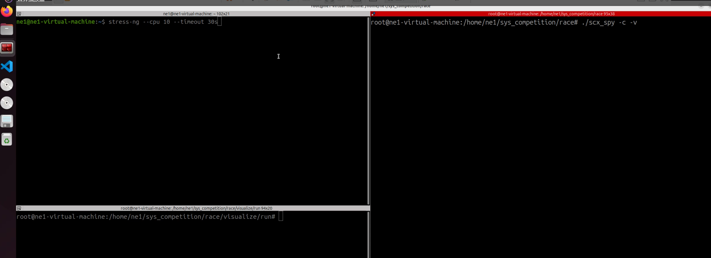
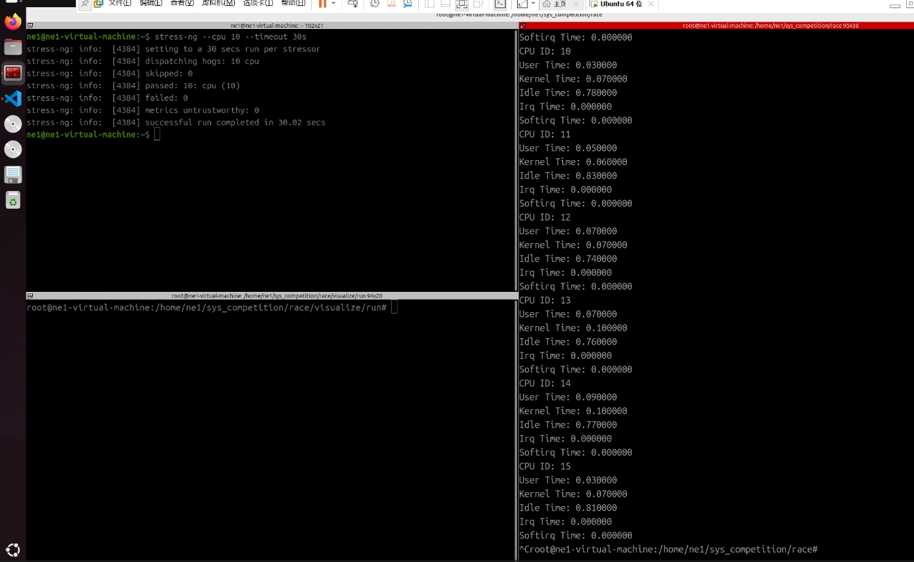
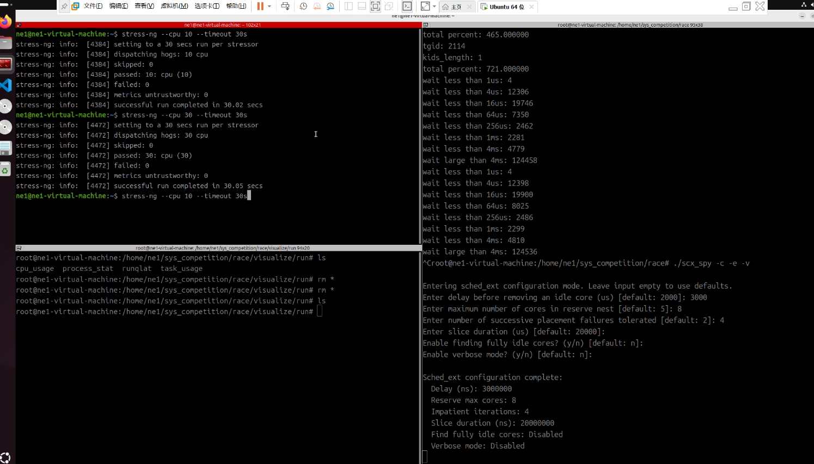
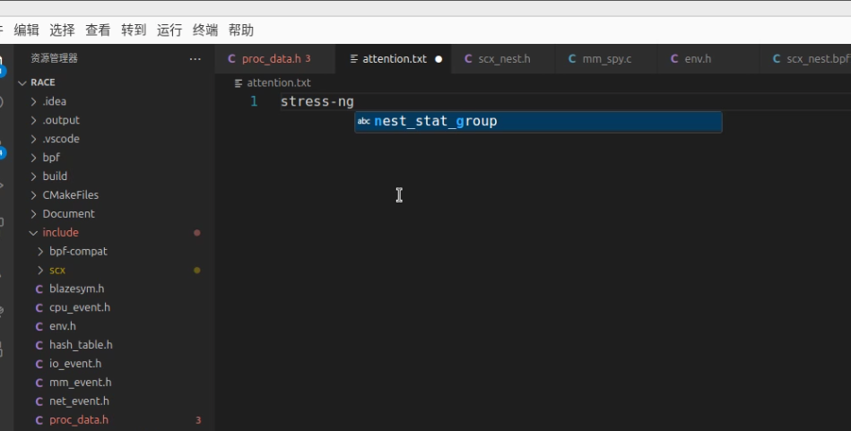
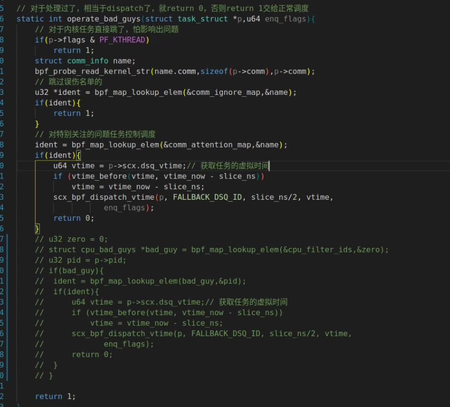
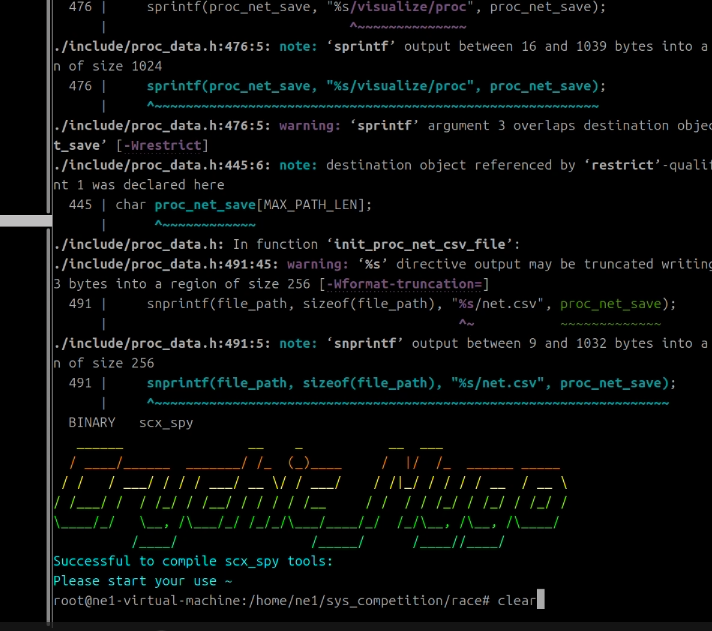
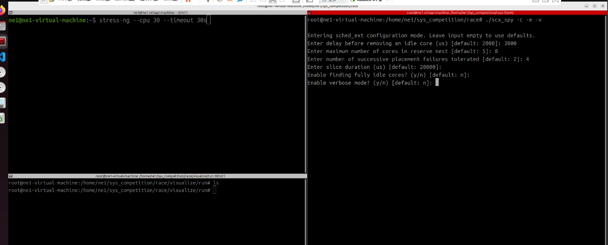
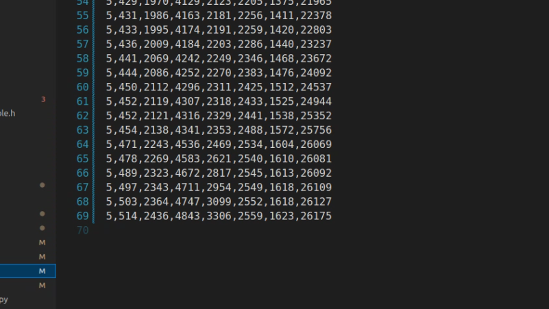

## scx-nest和监测程序的结合
scx-nest主要通过这几个map和监测程序交互

```c
struct{
	__uint(type, BPF_MAP_TYPE_ARRAY_OF_MAPS);
	__uint(max_entries, 1);
	__type(key, u32);
	__array(values,struct cpu_bad_guys);
} cpu_filter_ids SEC(".maps");

struct{
	__uint(type, BPF_MAP_TYPE_ARRAY_OF_MAPS);
	__uint(max_entries, 1);
	__type(key, u32);
	__array(values,struct task_cpu_usage_map);
} cpu_task_usage_map SEC(".maps");

// 处理用户态传的可能被误伤的任务名
struct {
	__uint(type, BPF_MAP_TYPE_HASH);
	__uint(max_entries, 1024);
	__type(key, struct comm_info);
	__type(value, u32);
} comm_ignore_map SEC(".maps");

// 处理用户态传的要去特别注意的任务
struct {
	__uint(type, BPF_MAP_TYPE_HASH);
	__uint(max_entries, 1024);
	__type(key, struct comm_info);
	__type(value, u32);
} comm_attention_map SEC(".maps");
```
- 核心机制
  - 在 scx-nest 中，以下两个结构实现了和 CPU 任务监控的映射
    - cpu_filter_ids 对应 thread_occupied_map，用于存储当前 CPU 占用率较高的线程身份信息
    - cpu_task_usage_map对应 task_cpu_usage_map，用于存储当前 CPU 占用率较高的线程的具体信息

当主程序同时启用 CPU 监测和 SCX-Nest 功能时，可以实现对高 CPU 占用任务的自动化抑制。具体抑制机制请参考 README 中的原理部分。

### 实验部分
实验目标：通过对比默认调度器和自定义调度机制，在不同 CPU 压力下评估系统性能表现

1. 对照组实验
   - 实验设计基于默认调度器，使用 stress-ng 施加不同级别的 CPU 压力，测试时间为 30 秒
   - 测试数据重点：runqlat 数据，反映系统的调度压力，任务调度等待时间越长，调度压力越高，系统可能处于过载状态


一般负载下，创建 10 个 CPU 负载任务，每次测试运行时间为 30 秒，确保数据采样稳定，最终的数据在[这里](Document/sched_ext/normal_cpu10.txt)，视频是“normal_cpu10"
```
stress-ng --cpu 10 --timeout 30
```




对于输出数据，重点关注最后几行
```
12,2991,7114,11747,1815,1193,2024,10096
12,3004,7212,11931,1837,1206,2045,10218
12,3012,7239,12077,1845,1212,2048,10229
12,3071,7361,12436,1861,1232,2078,10282
12,3120,7424,12662,1871,1235,2088,10296
```

之后增加压力，创建 30 个 CPU 负载任务，数据在[这里](Document/sched_ext/normal_cpu30.txt)，视频是"normal_cpu30"
```
1,32921,31062,6038,2919,3357,7310,149492
1,33031,31206,6416,2966,3366,7319,149506
1,33196,31480,7059,3037,3448,7406,149675
1,33230,31540,7433,3077,3455,7411,149689
1,33391,31688,7901,3099,3464,7426,149703
```
2. 实验组部分
   - 开始进行scx-nest的部分，同样使用 stress-ng 施加不同级别的 CPU 压力，测试时间为 30 秒


创建 10 个 CPU 负载任务，每次测试运行时间为 30 秒，情况[如下](Document/sched_ext/scx_cpu10.txt)，视频是”scx_cpu10"
```
0,642,6251,13554,9713,2194,1287,11171
0,651,6296,13793,10115,2209,1295,11246
0,658,6346,13889,10314,2213,1301,11289
0,663,6389,13956,10490,2235,1309,11330
0,670,6438,14097,10673,2262,1317,11388
0,677,6495,14166,10890,2298,1335,11435
```

30 个 CPU 负载任务的情况[如下](Document/sched_ext/scx_cpu30.txt)，视频是“scx_cpu30”
```
1,329,3762,9742,10231,13541,7742,30089
1,335,3856,9914,10523,13958,7897,30619
1,337,3909,10022,10668,14164,8004,31126
1,339,3964,10132,10792,14401,8160,31647
1,355,4137,10746,11094,14576,8255,31844
1,365,4213,11115,11397,14638,8285,31966
1,380,4505,11867,11972,14822,8483,32087
```

3. 实验结果
对比中等压力之下的调度情况
```
     1us,4us,16us,64us,256us,1ms,4ms,4ms+
默认  12,3120,7424,12662,1871,1235,2088,10296
nest  0,677,6495,14166,10890,2298,1335,11435
```
直接从数据上来看的话，scx-nest在中等压力之下，整体表现不如默认的CFS调度器，但值得注意的是，
对这两行按行统计和
- 12+3120+7424+12662+1871+1235+2088+10296=38508
- 0+677+6495+14166+10890+2298+1335+11435=46706

考虑到我的设计思路，对于“坏任务”尽可能延迟调度同时时间片分配减半，使得调度器的整体流量变大，
而统计runqlat时候是把“坏任务”的调度延迟算进去的，所以整体上来看scx-nest仍是有优势的

而对于高压情况，上面的优势就更加明显了
```
     1us,4us,16us,64us,256us,1ms,4ms,4ms+
默认  1,33391,31688,7901,3099,3464,7426,149703
nest  1,380,4505,11867,11972,14822,8483,32087
```
再不加区分的默认调度下，在4ms延迟之上的任务到了近15w，而有了区分的调度可以使得4ms延迟之上的任务只有3.2w，
可以看到随着压力上升到3倍

4ms延迟之上的任务对于nest来说即便维持线性增长，而对于默认的CFS调度器，
增长形势可能是指数增长，所以基于监控的scx-nest调度器明显由于默认的调度器，
对异常任务实现了自动化抑制

## 可插拔的调度器
可以看到刚才的map中有comm_ignore_map和comm_attention_map，这两个map分别是这样对应的
- comm_ignore_map —— ignore.txt
- comm_attention_map —— attention.txt

分别是仓库中的两个文件，打开ignore.txt可以看到
```
code
Compositor
gnome-shell
scx_spy
cpptools
llvmpipe-0
kworker
```
可以理解为用户态定义的“白名单”，对于这些名字的任务可以放任它们占用cpu

同样的attention.txt 则是“黑名单”，对于其中的任务，只有有了就直接抑制

有了这俩个文件，用户可以非常方便自定义对特定任务的调度，同时我的程序也可以作为一个插件，
如果你有更加高级的任务划分策略，可以把划分的任务放到这两个文件中，这个调度器可以帮你抑制或保持这些任务的运行

具体实验在链接的“attention_map”

可以看到现在attention.txt中加入stress-ng的名字




为了保证实验的公正性，把后续高cpu占用率任务判断的逻辑注释了，然后编译，最高压力下测试






可以看到，没了一些别的干扰，只针对stress-ng的抑制效果非常好，有了最精确的定位，所以延迟情况是最好的

所以即便作为一个工具来看，这个改进后的调度器有很高的实用价值