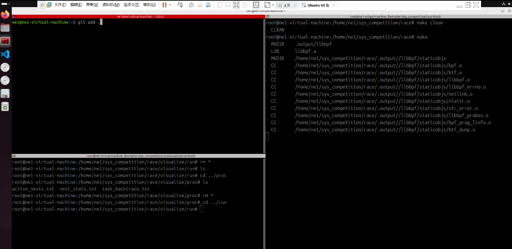
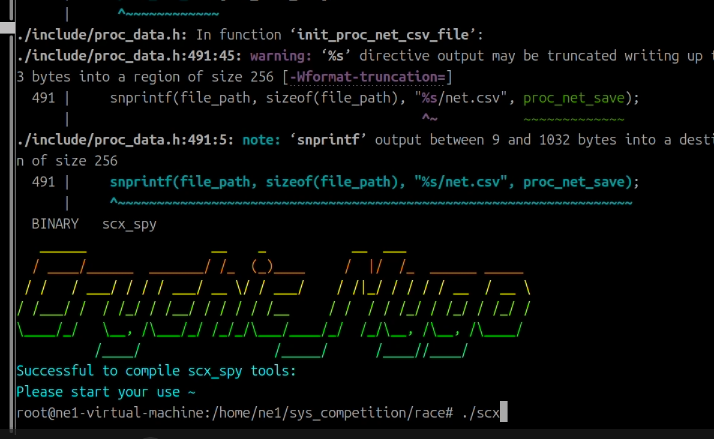
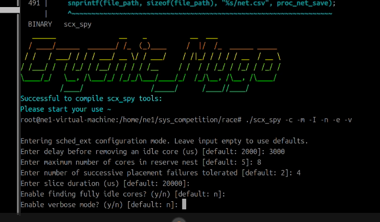
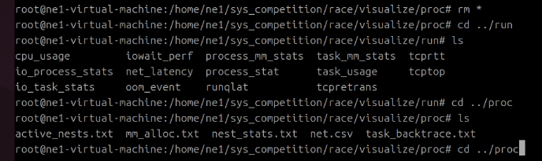

## 环境搭建
本项目可以从仓库中看到，分别有main和scx分支，建立在两个环境中

### main分支
main分支是最开始在实机上写的代码，具体版本和环境配置如下
1. 系统及内核版本
```shell
root@ne0-System:~# lsb_release -a
No LSB modules are available.
Distributor ID:	Ubuntu
Description:	Ubuntu 22.04.5 LTS
Release:	22.04
Codename:	jammy
```
```shell
root@ne0-System:~# uname -r
6.8.0-48-generic
```
2. LLVM工具链和rust工具链
```shell
root@ne0-System:~# clang --version
Ubuntu clang version 14.0.0-1ubuntu1.1
Target: x86_64-pc-linux-gnu
Thread model: posix
InstalledDir: /usr/bin
```
```shell
(base) ne0@ne0-System:~$ rustup show
Default host: x86_64-unknown-linux-gnu
rustup home:  /home/ne0/.rustup

stable-x86_64-unknown-linux-gnu (default)
rustc 1.79.0 (129f3b996 2024-06-10)
```
```shell
(base) ne0@ne0-System:~$ cargo --version
cargo 1.79.0 (ffa9cf99a 2024-06-03)
```

3. 环境配置

这里只说一下重要的几个源文件的安装，具体放的路径可以直接在Makefile里看到，如果想改直接改就行了
- libbpf安装
    - 建议从源码编译安装，https://github.com/libbpf/libbpf.git
```shell
$ cd src
$ make
```
- bpftool安装
    - 同样建议从源码编译安装，https://github.com/libbpf/bpftool.git
    - 具体构建安装的流程在官网这里都有

- blazesym安装
    - 从官方编译安装，https://github.com/libbpf/blazesym.git
```shell
git clone https://github.com/libbpf/blazesym.git
cd blazesym
cargo build --release
```
- 之后到 blazesym/capi文件夹下
```shell
cargo build --release
```
- 最终能在target/release文件夹下看到这些就算成功
```shell
(base) ne0@ne0-System:~/sys_competition/start/blazesym/target/release$ ls
build  examples     libblazesym_c.a  libblazesym_c.rlib  libblazesym.d
deps   incremental  libblazesym_c.d  libblazesym_c.so    libblazesym.rlib
```


### scx分支
scx分支是才有sched_ext，由于sched_ext是9月份刚出的，只有最新的内核才具备这个功能，所以我是在虚拟机上，
用的6.12的内核写的，为了不影响实机的其他事情，sched_ext都是在虚拟机上跑的，环境配置多了一些其他步骤

- 首先要说明的是，sched_ext这个功能具体你的内核支不支持，可以这样检查
```shell
root@ne0-System:~# zgrep -E "CONFIG_BPF|CONFIG_BPF_EVENTS|CONFIG_BPF_JIT|CONFIG_BPF_SYSCALL|CONFIG_DEBUG_INFO_BTF|CONFIG_FTRACE|CONFIG_SCHED_CLASS_EXT" /boot/config-$(uname -r)
CONFIG_BPF=y
CONFIG_BPF_SYSCALL=y
CONFIG_BPF_JIT=y
CONFIG_BPF_JIT_ALWAYS_ON=y
CONFIG_BPF_JIT_DEFAULT_ON=y
CONFIG_BPF_UNPRIV_DEFAULT_OFF=y
# CONFIG_BPF_PRELOAD is not set
CONFIG_BPF_LSM=y
CONFIG_BPF_STREAM_PARSER=y
CONFIG_DEBUG_INFO_BTF=y
CONFIG_DEBUG_INFO_BTF_MODULES=y
CONFIG_FTRACE=y
CONFIG_FTRACE_SYSCALLS=y
CONFIG_BPF_EVENTS=y
CONFIG_BPF_KPROBE_OVERRIDE=y
CONFIG_FTRACE_MCOUNT_RECORD=y
CONFIG_FTRACE_MCOUNT_USE_CC=y
# CONFIG_FTRACE_RECORD_RECURSION is not set
# CONFIG_FTRACE_STARTUP_TEST is not set
# CONFIG_FTRACE_SORT_STARTUP_TEST is not set
```
- 上面输出是我实机的输出，对于sched_ext，需要以下这些配置
```shell
CONFIG_BPF=y
CONFIG_SCHED_CLASS_EXT=y
CONFIG_BPF_SYSCALL=y
CONFIG_BPF_JIT=y
CONFIG_DEBUG_INFO_BTF=y
CONFIG_BPF_JIT_ALWAYS_ON=y
CONFIG_BPF_JIT_DEFAULT_ON=y
CONFIG_PAHOLE_HAS_SPLIT_BTF=y
CONFIG_PAHOLE_HAS_BTF_TAG=y
```
- 对于我虚拟机的输出，是这样的
```shell
ne1@ne1-virtual-machine:~$ zgrep -E "CONFIG_BPF|CONFIG_BPF_EVENTS|CONFIG_BPF_JIT|CONFIG_BPF_SYSCALL|CONFIG_DEBUG_INFO_BTF|CONFIG_FTRACE|CONFIG_SCHED_CLASS_EXT" /boot/config-$(uname -r)
CONFIG_BPF=y
CONFIG_BPF_SYSCALL=y
CONFIG_BPF_JIT=y
CONFIG_BPF_JIT_ALWAYS_ON=y
CONFIG_BPF_JIT_DEFAULT_ON=y
CONFIG_BPF_UNPRIV_DEFAULT_OFF=y
# CONFIG_BPF_PRELOAD is not set
CONFIG_BPF_LSM=y
CONFIG_SCHED_CLASS_EXT=y
CONFIG_BPF_STREAM_PARSER=y
CONFIG_DEBUG_INFO_BTF=y
CONFIG_DEBUG_INFO_BTF_MODULES=y
CONFIG_FTRACE=y
CONFIG_FTRACE_SYSCALLS=y
CONFIG_BPF_EVENTS=y
CONFIG_BPF_KPROBE_OVERRIDE=y
CONFIG_FTRACE_MCOUNT_RECORD=y
CONFIG_FTRACE_MCOUNT_USE_CC=y
```
- 下面把内核和系统版本，还有工具链版本都补充一下
```shell
ne1@ne1-virtual-machine:~$ lsb_release -a
No LSB modules are available.
Distributor ID:	Ubuntu
Description:	Ubuntu 24.04.1 LTS
Release:	24.04
Codename:	noble

ne1@ne1-virtual-machine:~$ uname -r
6.12.0-061200-generic

ne1@ne1-virtual-machine:~$ clang --version
Ubuntu clang version 17.0.6 (9ubuntu1)
Target: x86_64-pc-linux-gnu
Thread model: posix
InstalledDir: /usr/lib/llvm-17/bin

ne1@ne1-virtual-machine:~$ rustup show
Default host: x86_64-unknown-linux-gnu
rustup home:  /home/ne1/.rustup

stable-x86_64-unknown-linux-gnu (default)
rustc 1.79.0 (129f3b996 2024-06-10)

ne1@ne1-virtual-machine:~$ cargo --version
cargo 1.75.0
```

1. 6.12内核的配置和安装
- sched_ext官方的教程是没用的，官方给的教程中
```shell
$ sudo do-release-upgrade -d
$ sudo add-apt-repository -y --enable-source ppa:canonical-kernel-team/unstable
$ sudo sed -i "s/^Suites: .*/Suites: plucky/" \
  /etc/apt/sources.list.d/canonical-kernel-team-ubuntu-unstable-plucky.sources
$ sudo apt install -y linux-generic-wip

# 到了最后这步
ne1@ne1-virtual-machine:~$ sudo apt install -y linux-generic-wip
[sudo] password for ne1: 
正在读取软件包列表... 完成
正在分析软件包的依赖关系树... 完成
正在读取状态信息... 完成                 
E: 无法定位软件包 linux-generic-wip
```
- 去官网 https://launchpad.net/~canonical-kernel-team/+archive/ubuntu/unstable 也找不到相关的
- 所以我之后具体是这样安装的
- 首先去官网下载6.12版本的 https://kernel.ubuntu.com/mainline/v6.12/ ，将
  linux-headers-6.12.0-061200-generic、linux-image-unsigned-6.12.0-061200-generic、linux-modules-6.12.0-061200-generic、
  linux-headers-6.12.0-061200这些都安装到本地，之后
```shell
sudo dpkg -i linux-headers-6.12.0-061200*.deb linux-image-unsigned-6.12.0-061200-generic_*.deb linux-modules-6.12.0-061200-generic_*.deb
```
- 安装完成之后重启
```shell
sudo update-grub
sudo reboot
```
- 重启之后看内核版本，没问题的话就是我这个版本
```shell
ne1@ne1-virtual-machine:~$ uname -r
6.12.0-061200-generic
```

2. vmlinux.h的创建
- 对于6.12内核的系统，得自己生成vmlinux
```shell
bpftool btf dump file /sys/kernel/btf/vmlinux format c > vmlinux.h
```

3. 其他的libbpf、bpftool什么的都和上面流程一样了


无论是只有系统监测的os_spy或是完整功能的scx_spy，如果编译成功的话都应该如下
```shell
   ______                __    _           __  ___                
  / ____/______  _______/ /_  (_)____     /  |/  /_  ______ _____ 
 / /   / ___/ / / / ___/ __ \/ / ___/    / /|_/ / / / / __  / __ \ 
/ /___/ /  / /_/ / /__/ / / / / /__     / /  / / /_/ / /_/ / /_/ / 
\____/_/   \__, /\___/_/ /_/_/\___/____/_/  /_/\__, /\__, /\____/ 
          /____/                 /_____/      /____//____/      
Successful to compile os_spy tools:                           
Please start your use ~   
```

如果有了这个标志证明你编译成功了，congratulations :)


## 视频演示
在我分析的文件夹中，有个”整体流程“，有必要提醒的是，在我写分析文档时候的数据来源的实机，因为虚拟机占用资源过多，
我笔记本的电脑配置还要写文档会很不方便，而录视频的都是源于虚拟机，因为虚拟机上才能展示完整功能，
所以之后各个监控模块的介绍部分用的是实机，而实验部分用的是虚拟机

先把过去的测试数据清空，然后重新编译展现整个流程

下面这样就是编译成功



然后先整体演示一下
```shell
./scx_spy -c -m -I -n -e -v
```



完整监视情况下的文件


